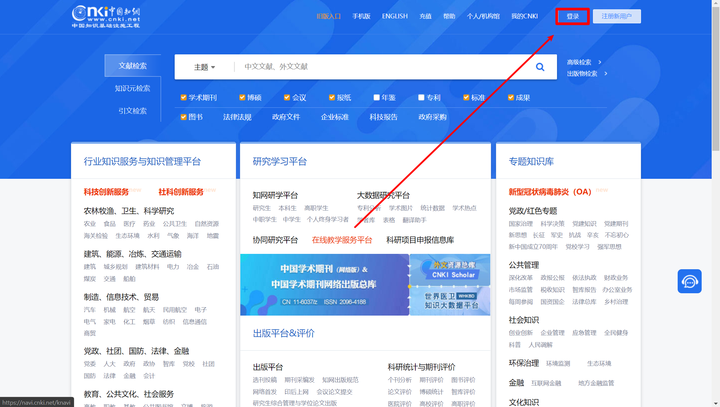
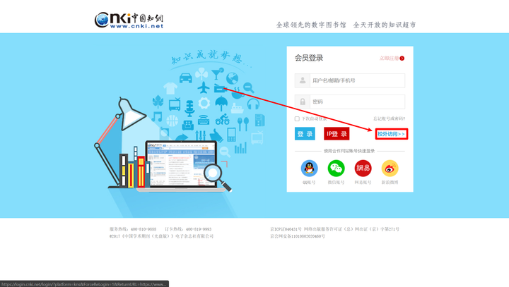
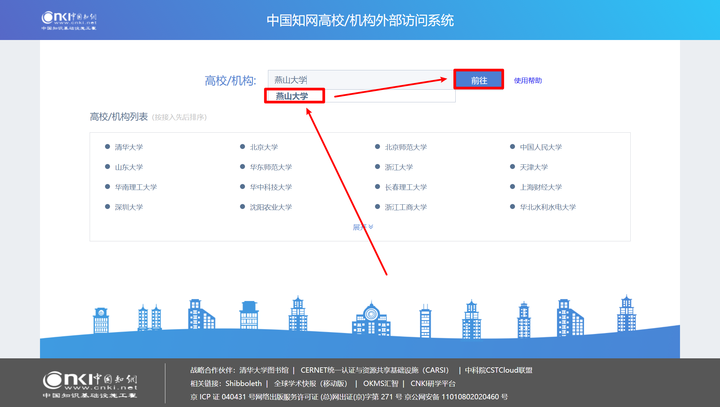
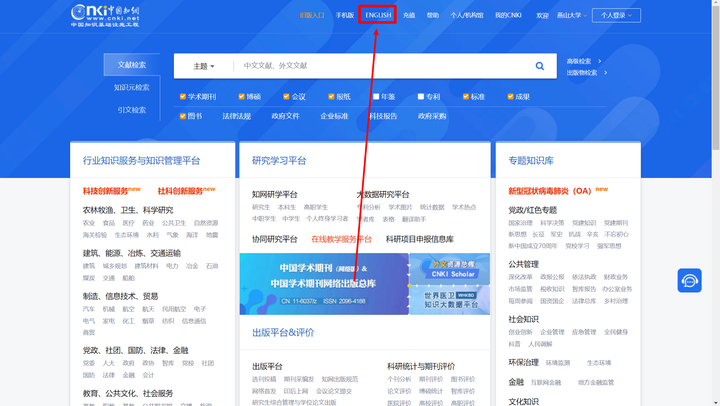

# 校外登录知网及文献 CAJ 转 PDF 的方法 

本文主要介绍如何**通过英文版知网下载PDF格式的文献**的方式

解决了因为知网限制**只能下载CAJ格式而无法下载部分文献PDF格式**的问题

其中引入了如何使用**校外登录的方式登录知网**的方法。

如果你觉得这篇文章对你有帮助，麻烦点赞让更多的人看到，谢谢

## **操作方法**

（1）打开知网登录机构账户/个人账户

目前大多数学校已经开放远程登陆，下载文献比原来要搞代理方便多了。

登录——校外访问——选择学校——前往——回调到首页

（2）登陆后进入英文版网页

**点击首页正上方的“ENGLISH”**

英文版长这个样子，和中文版排版差不多。

（3）输入文献名称进行检索

需要注意的是：

- 可以输入中文进行检索。
- 检索到的结果大多都是英文信息，但不代表是英文文献。
- 实测相同的关键字和中文搜索相比会有差距，因此不建议使用英文版泛搜。

（4）点开英文版的文献下载文献

正常来说，一般除了硕博士论文外，其他的（如期刊等）都支持PDF下载

**这个方法解决的主要是硕博士论文的CAJ下载问题**

比对一下

下载下来的文献除了名字是英文外，没有任何不同

希望能对你有帮助！