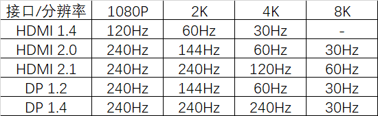
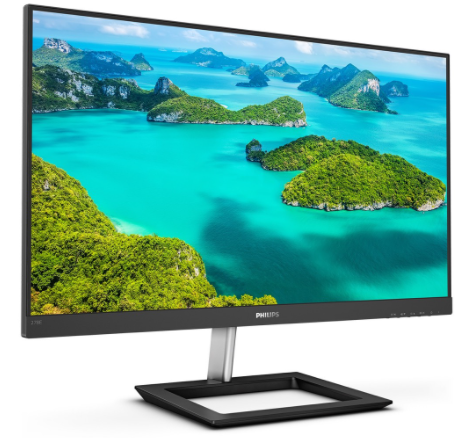
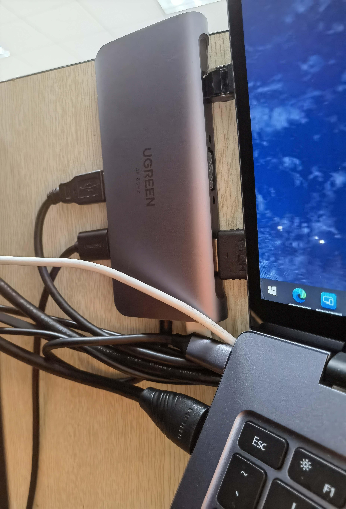
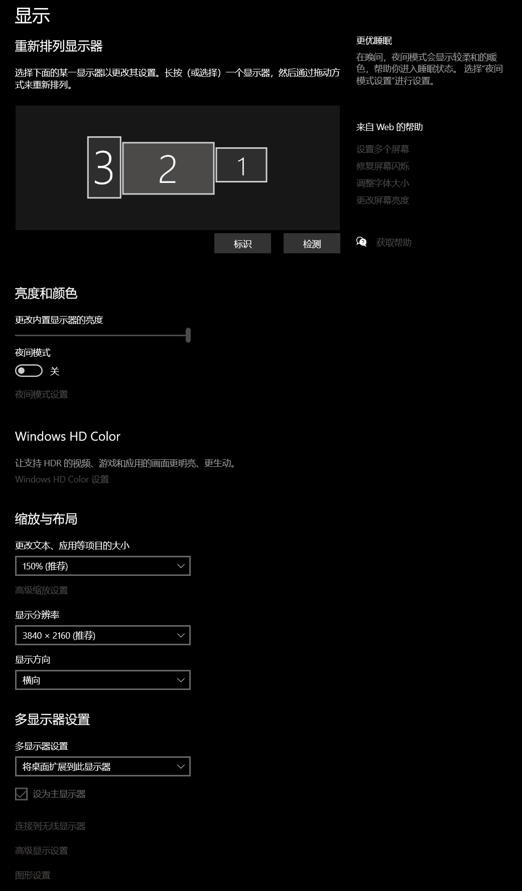
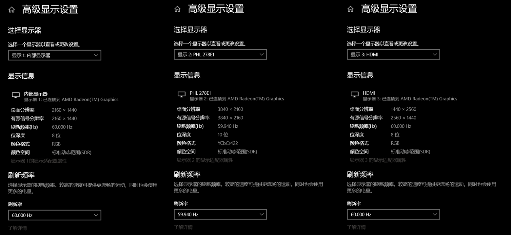
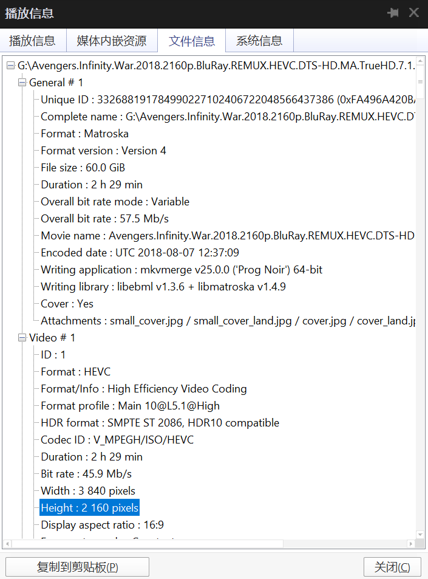

# MateBook14 外接 4k 屏幕的快乐

## Abstract

本文使用 MATEBOOK 14 R5 2020 电脑，通过 TypeC 连接支持 4k60Hz 的拓展坞，连接拓展坞 HDMI 来实现外接 4K 屏幕的外接，同时通过自带的 HDMI 连接 2k 屏幕实现外接，最终实现 4K27inch+2k24inch+2k 笔记本内置三屏幕同时显示，效果如下图所示。

## 1 研究对象：MATEBOOK 14 锐龙版 R5 2020 款

> 本人有两个笔记本，一个是多年前的坠机堡垒，之前一直使用外接屏幕，可是因为某些未知的原因（多半是废了）在外接屏幕时经常出现间歇性黑屏，无法再胜任科研任务，遂准备退休，并将为了方便办公而购置的小妾 MATEBOOK14 提上正位。

### 1.1 各个接口可支持的分辨率和刷新率如下图所示：

### 1.2 MATEBOOK 接口参数如下：

- USB-C*1 视频接口类型：DP1.2 最高支持 4k 240Hz

- HDMI*1 视频接口类型：HDMI1.4 最高支持 4k 30Hz

### 1.3 使用场景：

- 无任何游戏需求（不强迫核显）

- 看论文/做笔记/办公/跑不需要 GPU 的仿真居多（不上高刷）

- 未来计划购置 MAC mini

### 1.4 与华为官方探讨能不能用

界面为了保护隐私无法截图，以下内容为复制结果。

> **我：** 
华为 matebook14 2020 锐龙版 R5 外界显示器。我有一块 4k 和 2k 的屏幕，通过 HDMI 接口接 2k 屏幕，输出 2k60hz，通过 TypeC 接口+绿联支持 4k60hz 的拓展坞接 4k 的屏幕，能不能输出 4k60hz
**客服：** 
USB-C 接口功能 左边 USB-C 接口支持数据（USB3.2 Gen 1）和 DisplayPort(最大分辨率 4K@60HZ 像素)
感谢您的耐心等待，这款通过 TypeC 接口+绿联支持 4k60hz 的拓展坞接 4k 的屏幕，可以输出 4k60hz
**我：** 
C-转接器-HDMI 对吧
**客服：** 
是的，电脑端的 Type-c 连接的是拓展坞，电脑接口和拓展坞支持最大输出 4K@60HZ，且显示器是 4K 屏幕，就可以的
**我：** 
那如果我 C 口接 4k，HDMI 接 2k 可以吧？
**客服：** 
两个接口连接的两个显示器对嘛~
**我：** 
对，c 口接 4k，hdmi 接 2k
**客服：** 
好的，拓展坞一个，HDMI 一个，是可以的~

## 2 实验工具

> 面板未涨价前已经购置了一台 SANC 的 24 寸 2k 显示器，正逢 618 大促，部分显示器开始降价，其中飞利浦的这款 278E1 最离谱，便宜 600，价格直逼 2k 显示器，遂入手。为了实现 4k 显示，又购入绿联的一款支持 4k60Hz 的拓展坞。

### 2.1 PHILIPS 278E1 4k 显示器

官方说明页：[http://www.mmd-p.com.cn/Philipsmonitor/Product/product_show/id/1188.shtml](http://www.mmd-p.com.cn/Philipsmonitor/Product/product_show/id/1188.shtml)

显示参数：3840×2160 27inch 60Hz 350Nit 
色彩参数：NTSC 91% sRGB 109% E＜2 10bit
尺寸参数：613 × 461 ×192 mm
接口情况：HDMI*2 DP*1
购入价格：￥1599（根据喵喵折历史最低￥1399）

### 2.2 SANC N50Plus 2k 显示器

官方说明页：[http://ccclcd.com/goods/162](http://ccclcd.com/goods/162)

显示参数：2560×1440 60Hz 23.8inch 250Nit 
色彩参数：8bit
尺寸参数：538.97 × 400.14 × 151.31mm
接口情况：VGA*1 HDMI*2 DP*1
购入价格：￥749（2021/01 购入，现价￥949）

### 2.3 绿联 CM179 4k60Hz 版拓展坞

支持 PD 充电（因为 MATEBOOK14 锐龙版 2020 只有一个 C 口）
支持千兆有线网络
支持 HDMI2.0 4k60Hz 输出
**不支持与 VGA 同时独立输出，且双连接时，不支持 4k**

华为官方拓展坞 MateDock 不支持 4k60Hz，请绕行

目前网上口碑比较好的主要有贝尔金和苹果官方产品以及飞利浦，贝尔金多功能拓展坞的价格可能比我的屏幕都贵，苹果主要担心适配问题，飞利浦暂未找到可以支持 4k60Hz 的拓展坞。

坊间传说绿联的拓展坞保护电路有问题，如果使用此拓展坞进行 PD 充电，可能会导致主板烧坏，但是也没有别的更好的选择了，并且根据我的个人需求，未来接入 4k 屏幕的主要是 MAC mini，因此先买来用着。

可惜的是没钱买带 DP 接口的了，虽然目前显示水平已经达到，但是 DP 接口带宽更高更加稳定。

## 3 使用效果

已经完美运行 3 天，无频闪无卡顿无黑屏无爆炸无过热

### 3.1 如何连接？

电脑——TypeC——绿联拓展坞——HDMI——4k 显示器

电脑——HDMI——2k 显示器

### 3.2 电脑显示设置界面

可惜不支持 HDR

## 4 Enjoy it!

安装完之后里面就在网上找了一个 60G 的 4k 的资源

体验极佳

4k 壁纸出处：

[https://alphacoders.com](https://alphacoders.com/)

[https://wallpapercave.com](https://wallpapercave.com/)
