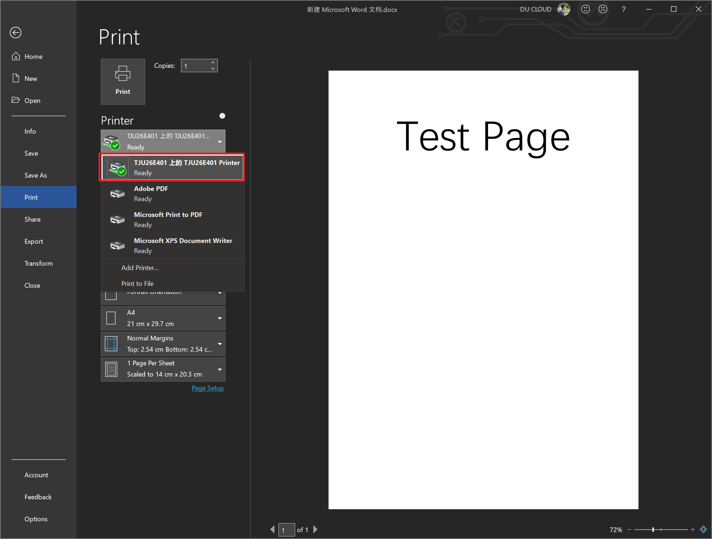

# 连接共享家庭组的打印机指南

## Abstract

新增：接入“tjuwlan”无限校园网的设备直接发现打印机并进行打印

至此，此打印机支持以下三种打印方式：

- 有线连接电脑通过家庭组电脑连接打印机
- 通过“tjuwlan”无线校园网连接打印机
- 单独连接WiFi-Direct无线网络连接打印机

### 我应该选择哪种连接方式

- 如果你的电脑是台式机使用有线网络连接——有线连接
- 如果你使用笔记本——通过“tjuwlan”无线连接
- WiFi-Direct只是备选方案，不推荐使用

***

## 1 通过网线有线连接

仅支持401室内连接有线网络的同学进行打印

此连接方式一劳永逸，不需要后续改动

- A1 打开**资源管理器**（此电脑/我的电脑）
  
- A2 在侧边栏单击**网络**
  

- 若windows未开启网络发现与文件共享会发现不了任何网络，请按照下图开启网络发现与文件共享，如图2-2-1，在新弹出的窗口中点击“否”

- A3 刷新一下此界面，即可出现N多个网络邻居，找到**名为“TJU26E401”的计算机**，双击进入
  

- A4 双击TJU26E401计算机下**名为“TJU26E401 Printer”的打印机**，等待安装过程

-   A5 Enjoy it! 在打印的时候选择打印机“TJU26E401 上的 TJU26E401”
  

***

## 2 通过“tjuwlan”连接打印机

通过连接tjuwlan进行上网的同学

只要你通过“tjuwlan”上网，那就能非常简单的发现打印机

- B1 连接“tjuwlan”无线校园网，需要保证能够连接互联网

> 温馨提示：在校园网服务界面开启”MAC认证“就不用每次联网都得去网页登陆了

- B2 打开设置中的**打印机和扫描仪**，选择**添加打印机**

- B3 找到名为 **HP85C1AB(HP LaserJet Pro M404-405)** 的打印机，添加，耐心等一会安装成功就可以了

- B4 然后就可以打印了

***

## 3 通过WiFi-Direct连接打印机（不推荐）

不推荐此类方法，只作为备选方案

WiFi-Direct的相关信息如下：

SSID: DIRECT-AC-HP dw ZW
Code: 401447zuo
打印机名称：HP85C1AB(HP LaserJet Pro M404-405)

搜索名为**DIRECT-AC-HP dw ZW**的WiFi，连接之后，参考第三章安装打印机的方式安装即可。

