# Git 版本管理

## 1 Git安装

官网：[Git](https://git-scm.com/)

下载适合自己电脑的版本，并安装

**安装时最好加入环境变量，直接可以通过Window Command调用**

## 2 Git 初始化

假设代码所在文件夹的路径为：`C:\Users\EnergyGroup\Desktop\重点实验室项目\05_Code\APP_6.0`

假设用户叫Tim，他的邮箱是Tim@apple.com，他做的项目名为Distributed_Energy_System

### 01 配置配置用户信息

> 用户和邮箱便于记录到底是谁在操作代码，这个和你电脑账户以及GitHub账户莫得关系

- 查看一下用户信息，输入```git config --list```

- 修改或者添加用户信息，输入自己的用户名和邮箱

  ```
  git config --global user.name "Tim" 
  git config --global user.email "Tim@apple.com" 
  ```

> 此处是全局用户信息，当然可以按照文件夹设定局域的用户信息

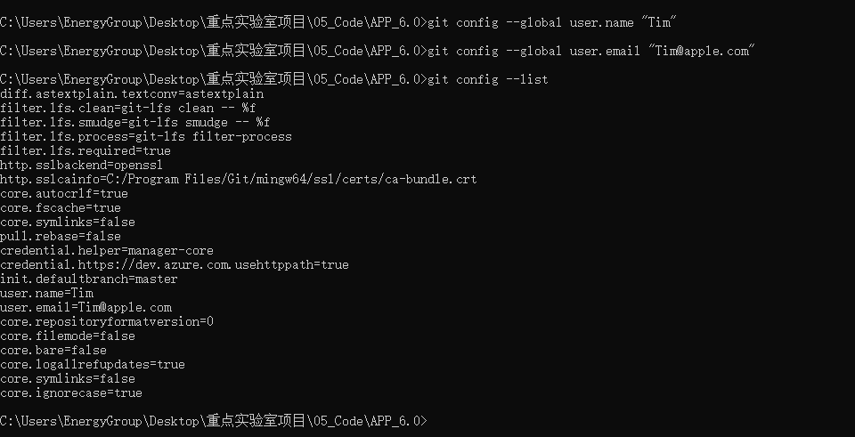

### 02 生成本地SSH

> SSH分公钥和私钥，实现本地和服务器的认证

- 输入```ssh-keygen -t rsa -C"Tim@apple.com"```
- Enter直接在默认文件上生成
- 设置密码（直接回车不设置密码）
- 在User目录中的.ssh文件夹```C:\Users\EnergyGroup\.ssh```里生成id_rsa和id_rsa.pub文件

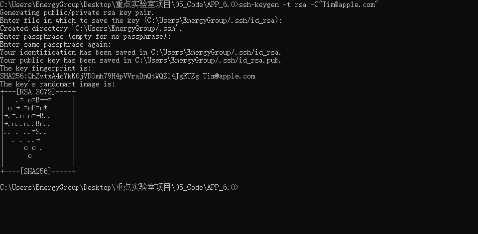

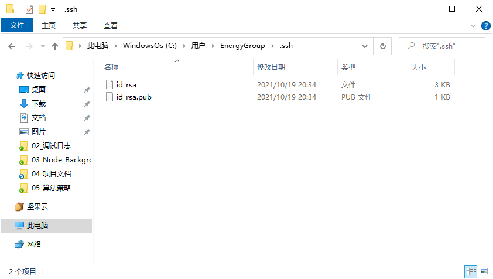

### 03 公钥GitHub

> 简单来说就是授权GitHub能够获取本地的Git

- 登录GitHub
- 头像——Setting——SSH and GPG keys——SSH keys栏——New SSH key
- 填写Title，随你便
- 用记事本打开id_rsa.pub，复制所有内容到Key中
- 点击Add SSH key
- 打开cmd输入```ssh -T git@github.com```

验证成功即可

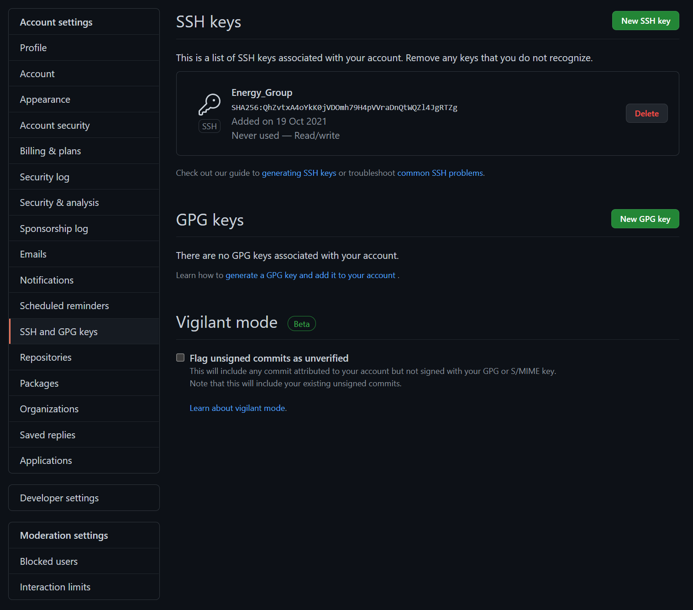

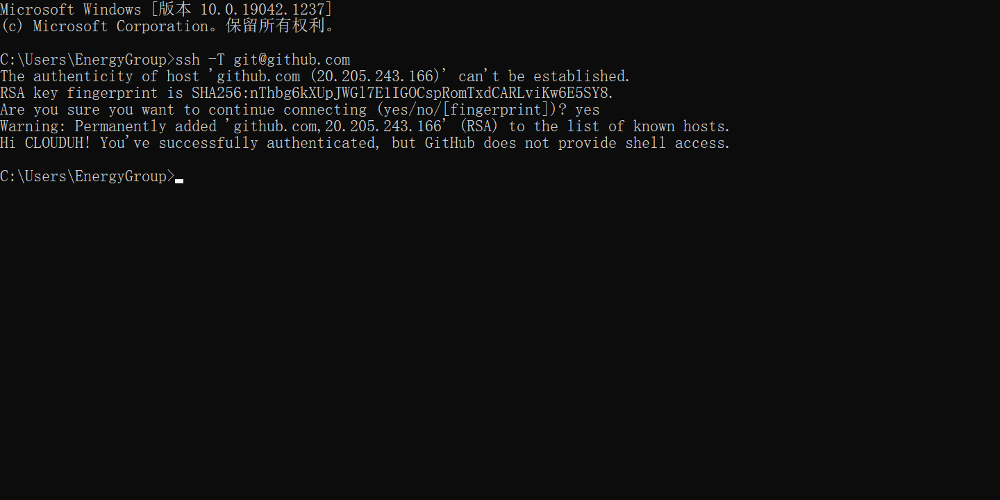

### 04 初始化仓库Git

- 输入``` cd/d C:\Users\EnergyGroup\Desktop\重点实验室项目\05_Code\APP_6.0 ``` 定位到代码路径
- 输入```git init```初始化仓库
- 输入```dir```查看代码目录下所有文件（当然你也可以打开文件夹直接对照）
- 根据上述目录的文件，通过```git add XXXX```加入仓库中

> 应注意，文件夹后面应该添加斜杠，添加所有文件就使用\*

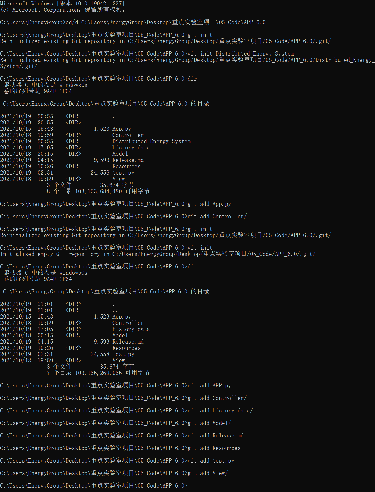

添加错了文件？输入```git rm file_name```删除它

## 3 Branch & Commit

> 没有分支管理就没有Git——我刚说的

###  01 Git 版本发布策略 GitHub Flow

[GitHub Flow – Scott Chacon](http://scottchacon.com/2011/08/31/github-flow.html)

现在用的比较多的吧，结合GitHub就比较方便管理

- master 分支上的代码都是可部署运行的
- 从 master 分支出新分支来开发新功能，分支名称要有描述性（如 new-oauth2-scopes）
- 本地创建的分支频繁地 push 到远程服务器同名分支上
- 如果你需要反馈或帮助，或你觉得你的分支可以被合并，提交一个pull request
- 功能开发完成提交的 pr 通过他人 review 后，可以将分支合并到 master
- 一旦合并和 push 到 master 分支后，你可以并且应该尽快进行部署测试

### 02 Git 创建分支与提交commit

- 输入```git branch master```创建主分支
- 输入```git checkout master```进入master分支
- 做一番修改后（比如我们新建后添加了所有的文件）
- 输入```git commit -m "init master"```向master中添加本次提交的注释

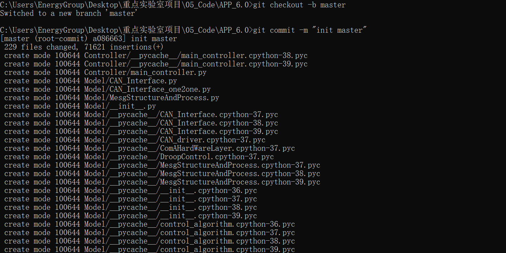

> 如何检查到底有没有遗漏呢？借助vscode中git插件看看有没有旁标就可以了，当让你也可以在vscode中进行git的修改

创建错了分支？输入```git branch -d branch_name```

## 4 Git Push & Pull

### Push 推送

改动现在已经在本地仓库的HEAD中了，通过Push将改动推送到远端仓库（GitHub）

- 打开GitHub——Your Repositories——New
- 填写Repositories Name和Description
- 选择Private创建
- 复制SSH的链接

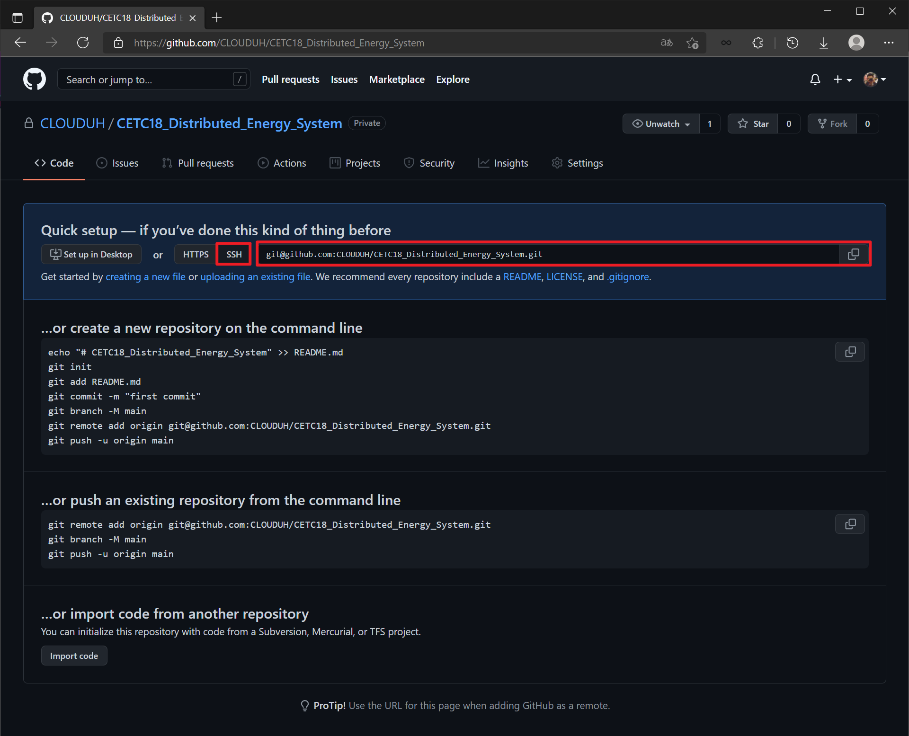

> HTTPS链接是用来本地克隆远程仓库用的，本地推送到远程仓库需要用SSH

- 输入```git remote add origin URL ```添加远程存储库
- 输入```git push -u origin master```推送上去

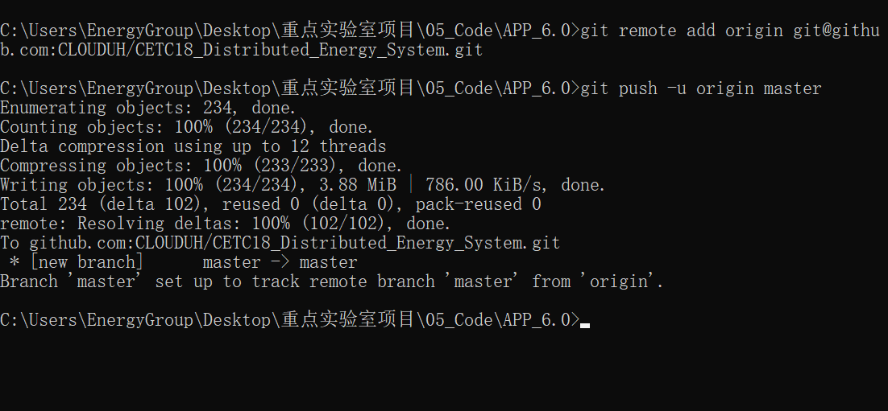

此时此刻，GitHub上就已经有了

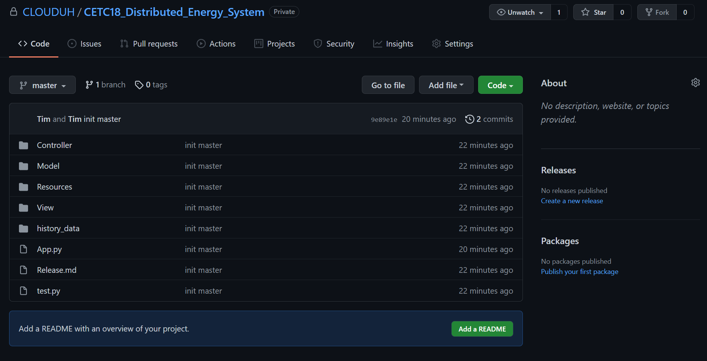

## Pull 拉取

当远程仓库有修改时，通过Pull命令拉取到本地

> 注意通过ssh的方式拉取和提交代码的时候需要在 git pull 和 git push 的后面加上ssh的地址，每次操作的时候都需要ssh地址，很不方便，所以这种方式并不是很推荐

- 输入```git pull ```

## 5 协同代码

> 注意，多人协同时，先拉取到本地，再进行修改，最后推送
>
> 为了避免狗屎行为，建议通过分支划分每个人的工作

- 当前Repository——Settings——Manage access——Add people
- 输入朋友的名号添加即可

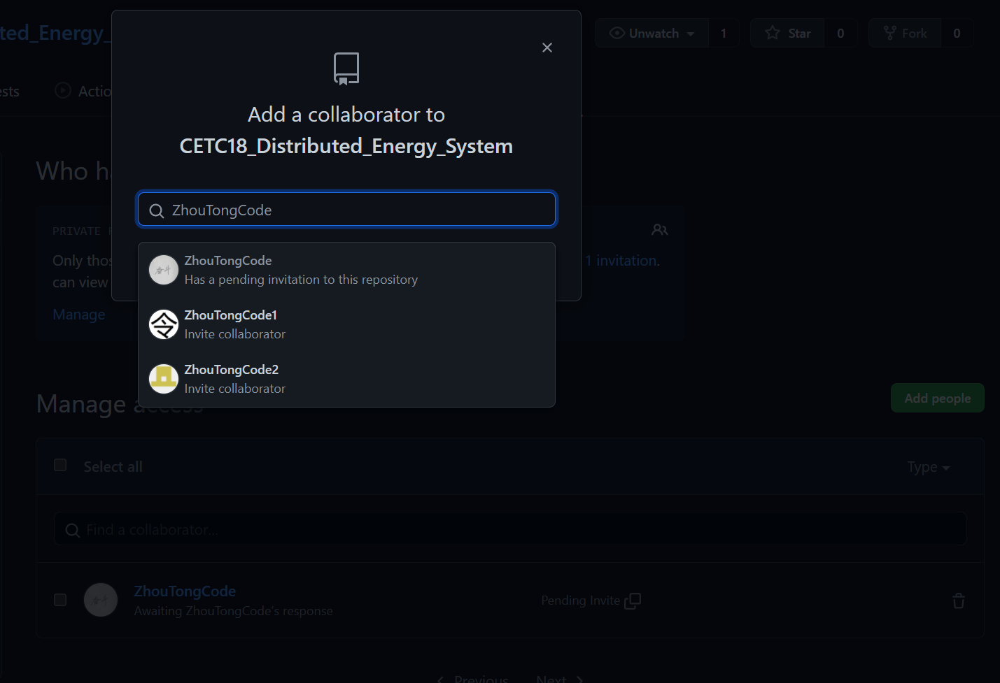

在接收到邀请之后，同事的GitHub上中Repository中会出现此项目，需要克隆到本地

- GitHub——目标Repository——Code——复制SSH链接

> **SSH 和 HTTPS Clone的主要区别**
> 使用https url克隆对初学者来说会比较方便，复制https url然后到git Bash里面直接用clone命令克隆到本地就好了，但是每次fetch和push代码都需要输入账号和密码，这也是https方式的麻烦之处。
> 而使用SSH url克隆却需要在克隆之前先配置和添加好SSH key，因此，如果你想要使用SSH url克隆的话，你必须是这个项目的拥有者。
> 否则你是无法添加SSH key的，另外ssh默认是每次fetch和push代码都不需要输入账号和密码，如果你想要每次都输入账号密码才能进行fetch和push也可以另外进行设置

- 输入```cd/d C:\Users\EnergyGroup\Desktop\CloneCode```转到你要保存的目录
- 输入```git clone git@github.com:CLOUDUH/CETC18_Distributed_Energy_System.git```

> 对于私有仓库来说，必须是授权用户授权公钥后才能用SSH链接克隆，不能使用HTTPS克隆
>
> CMD窗口无法调用GitHub登录页面，或许使用VSCode终端能够掏出登录窗口

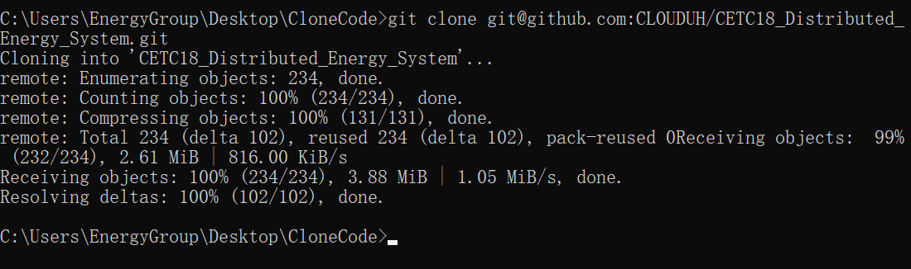

因为开放了权限，因此修改——提交——推送后，GitHub上能够看到提交的改动

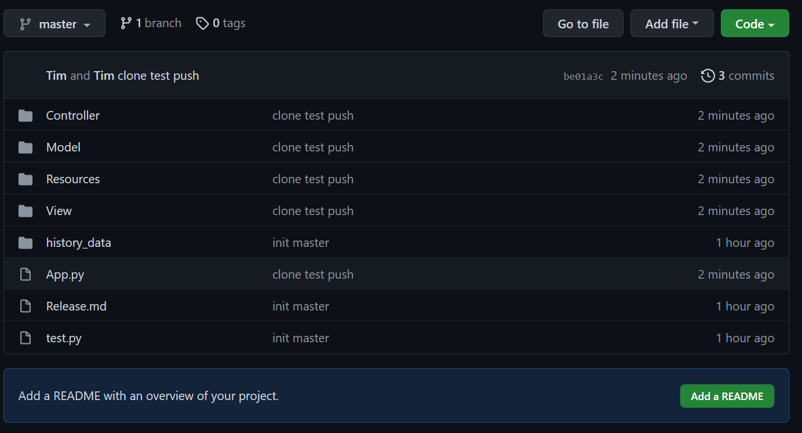

## 6 .gitignore 忽略缓存文件

.gitignore可以避免把恶心的缓存文件以及历史数据Push到远程仓库

关于基本的.gitignore编写规则，参考官方给出的[github/gitignore](https://github.com/github/gitignore)

- 忽略文件夹A ```A/```
- 忽略所有的.class文件 ```*.class```
- 忽略C文件夹下的B文件 ```*C.B```

> 应注意，如果远程仓库已经含有.gitignore中忽略的文件，请先删除远程仓库（可以删除本地的然后Push上去）

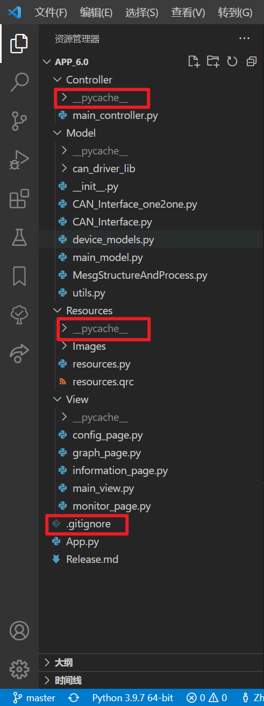

