# Git 版本管理

## 1 Git 安装

官网：[Git](https://git-scm.com/)

下载适合自己电脑的版本，并安装

**安装时最好加入环境变量，直接可以通过 Window Command 调用**

## 2 Git 初始化

假设代码所在文件夹的路径为：`C:\Users\EnergyGroup\Desktop\重点实验室项目\05_Code\APP_6.0`

假设用户叫 Tim，他的邮箱是 Tim@apple.com，他做的项目名为 Distributed_Energy_System

### 01 配置配置用户信息

> 用户和邮箱便于记录到底是谁在操作代码，这个和你电脑账户以及 GitHub 账户莫得关系

- 查看一下用户信息，输入```git config --list```

- 修改或者添加用户信息，输入自己的用户名和邮箱

  ```
  git config --global user.name "Tim" 
  git config --global user.email "Tim@apple.com" 
  ```

> 此处是全局用户信息，当然可以按照文件夹设定局域的用户信息

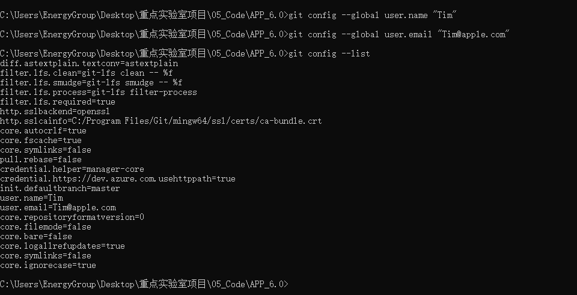

### 02 生成本地 SSH

> SSH 分公钥和私钥，实现本地和服务器的认证

- 输入```ssh-keygen -t rsa -C"Tim@apple.com"```
- Enter 直接在默认文件上生成
- 设置密码（直接回车不设置密码）
- 在 User 目录中的.ssh 文件夹```C:\Users\EnergyGroup\.ssh```里生成 id_rsa 和 id_rsa.pub 文件

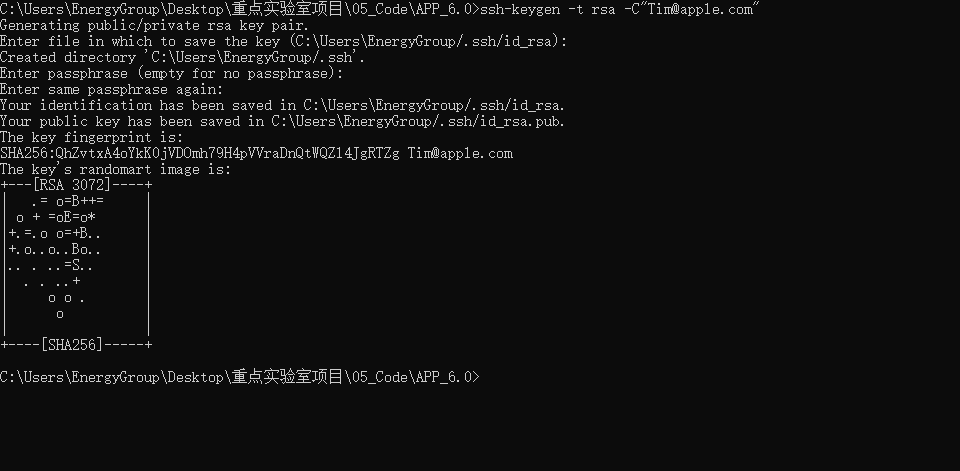

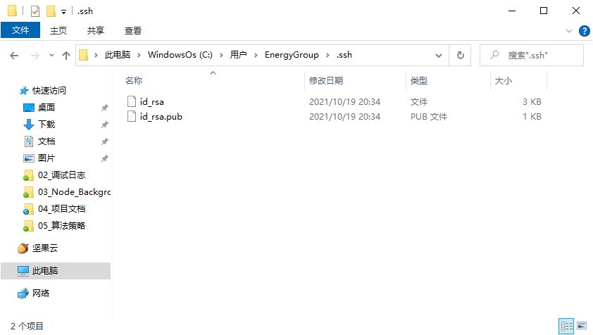

### 03 公钥 GitHub

> 简单来说就是授权 GitHub 能够获取本地的 Git

- 登录 GitHub
- 头像——Setting——SSH and GPG keys——SSH keys 栏——New SSH key
- 填写 Title，随你便
- 用记事本打开 id_rsa.pub，复制所有内容到 Key 中
- 点击 Add SSH key
- 打开 cmd 输入```ssh -T git@github.com```

验证成功即可

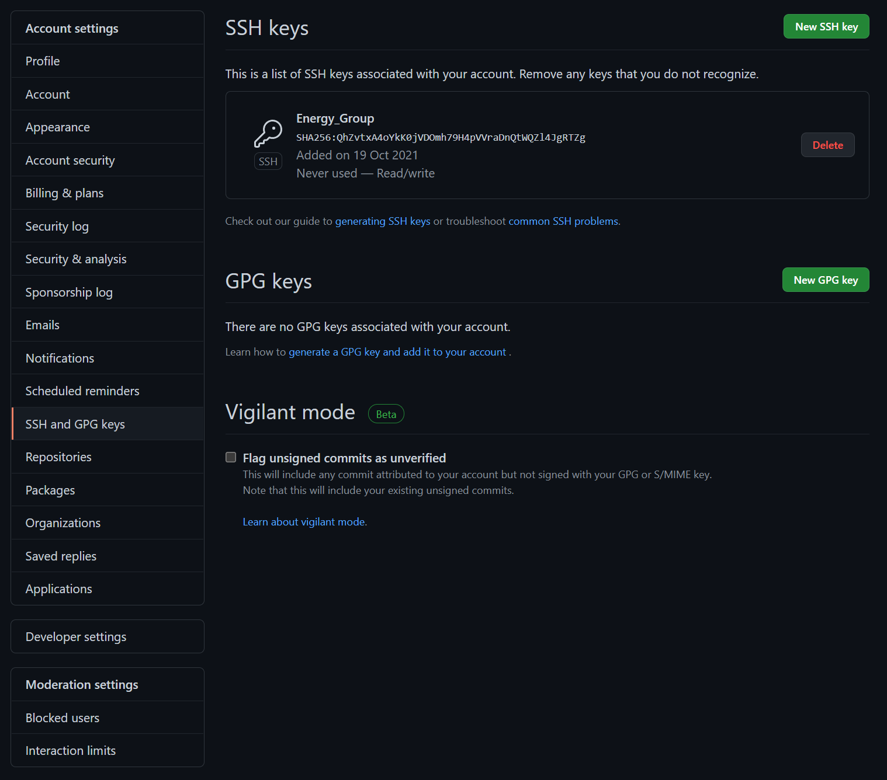

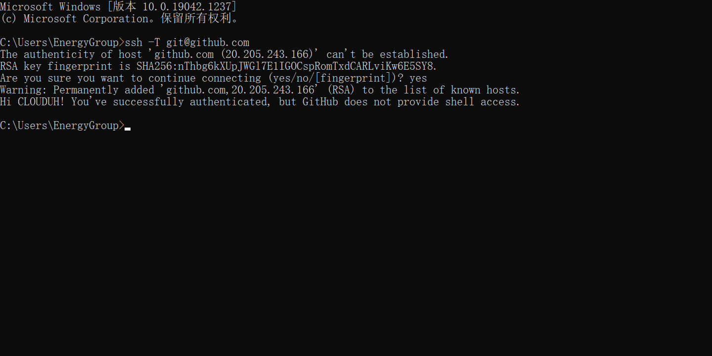

### 04 初始化仓库 Git

- 输入``` cd/d C:\Users\EnergyGroup\Desktop\重点实验室项目\05_Code\APP_6.0 ``` 定位到代码路径
- 输入```git init```初始化仓库
- 输入```dir```查看代码目录下所有文件（当然你也可以打开文件夹直接对照）
- 根据上述目录的文件，通过```git add XXXX```加入仓库中

> 应注意，文件夹后面应该添加斜杠，添加所有文件就使用\*

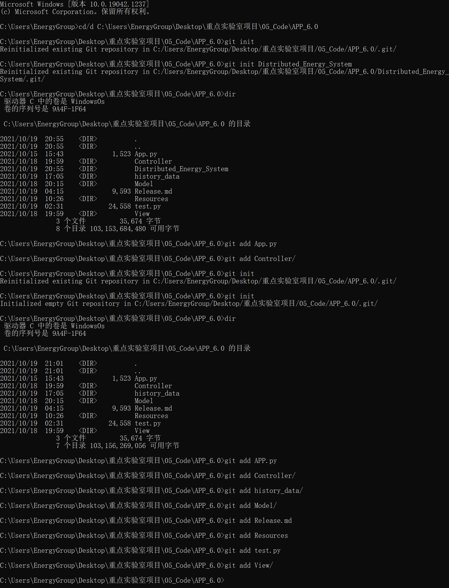

添加错了文件？输入```git rm file_name```删除它

## 3 Branch & Commit

> 没有分支管理就没有 Git——我刚说的

###  01 Git 版本发布策略 GitHub Flow

[GitHub Flow – Scott Chacon](http://scottchacon.com/2011/08/31/github-flow.html)

现在用的比较多的吧，结合 GitHub 就比较方便管理

- master 分支上的代码都是可部署运行的
- 从 master 分支出新分支来开发新功能，分支名称要有描述性（如 new-oauth2-scopes）
- 本地创建的分支频繁地 push 到远程服务器同名分支上
- 如果你需要反馈或帮助，或你觉得你的分支可以被合并，提交一个 pull request
- 功能开发完成提交的 pr 通过他人 review 后，可以将分支合并到 master
- 一旦合并和 push 到 master 分支后，你可以并且应该尽快进行部署测试

### 02 Git 创建分支与提交 commit

- 输入```git branch master```创建主分支
- 输入```git checkout master```进入 master 分支
- 做一番修改后（比如我们新建后添加了所有的文件）
- 输入```git commit -m "init master"```向 master 中添加本次提交的注释

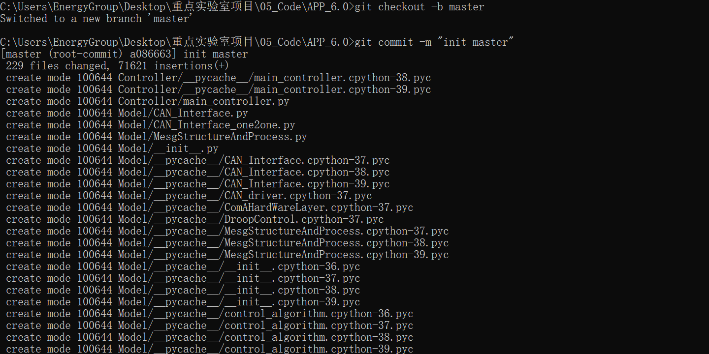

> 如何检查到底有没有遗漏呢？借助 vscode 中 git 插件看看有没有旁标就可以了，当让你也可以在 vscode 中进行 git 的修改

创建错了分支？输入```git branch -d branch_name```

## 4 Git Push & Pull

### Push 推送

改动现在已经在本地仓库的 HEAD 中了，通过 Push 将改动推送到远端仓库（GitHub）

- 打开 GitHub——Your Repositories——New
- 填写 Repositories Name 和 Description
- 选择 Private 创建
- 复制 SSH 的链接

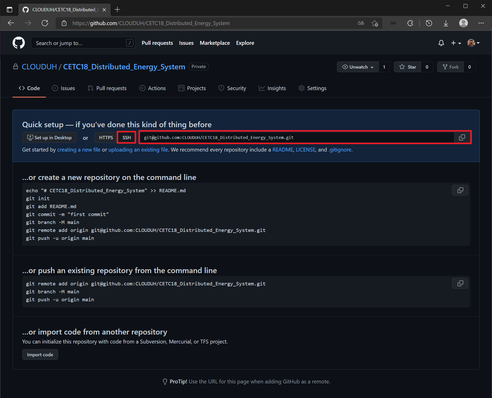

> HTTPS 链接是用来本地克隆远程仓库用的，本地推送到远程仓库需要用 SSH

- 输入```git remote add origin URL ```添加远程存储库
- 输入```git push -u origin master```推送上去

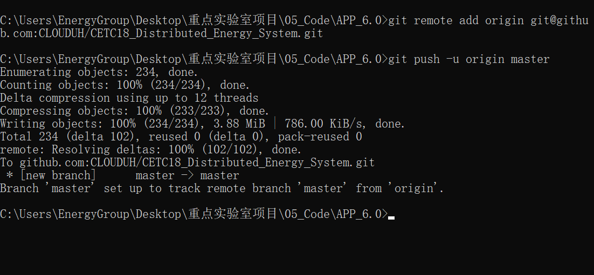

此时此刻，GitHub 上就已经有了

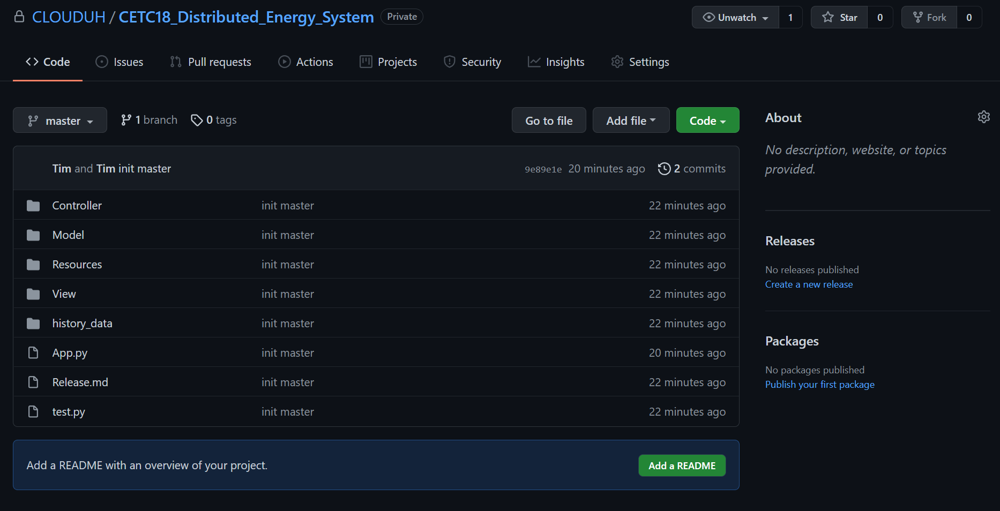

## Pull 拉取

当远程仓库有修改时，通过 Pull 命令拉取到本地

> 注意通过 ssh 的方式拉取和提交代码的时候需要在 git pull 和 git push 的后面加上 ssh 的地址，每次操作的时候都需要 ssh 地址，很不方便，所以这种方式并不是很推荐

- 输入```git pull ```

## 5 协同代码

> 注意，多人协同时，先拉取到本地，再进行修改，最后推送
>
> 为了避免狗屎行为，建议通过分支划分每个人的工作

- 当前 Repository——Settings——Manage access——Add people
- 输入朋友的名号添加即可

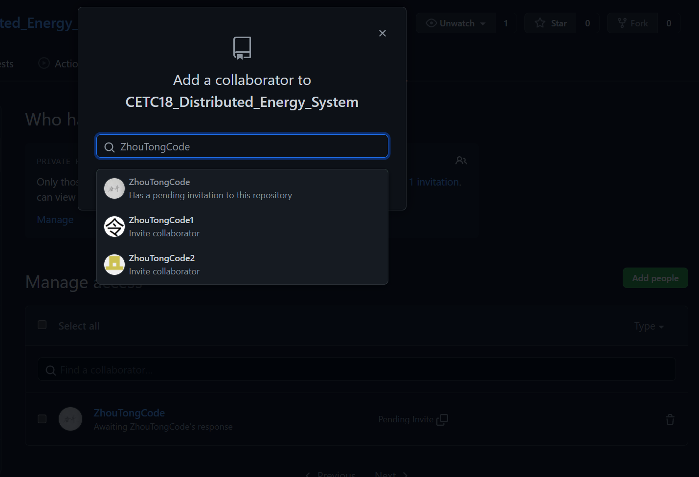

在接收到邀请之后，同事的 GitHub 上中 Repository 中会出现此项目，需要克隆到本地

- GitHub——目标 Repository——Code——复制 SSH 链接

> **SSH 和 HTTPS Clone 的主要区别**
> 使用 https url 克隆对初学者来说会比较方便，复制 https url 然后到 git Bash 里面直接用 clone 命令克隆到本地就好了，但是每次 fetch 和 push 代码都需要输入账号和密码，这也是 https 方式的麻烦之处。
> 而使用 SSH url 克隆却需要在克隆之前先配置和添加好 SSH key，因此，如果你想要使用 SSH url 克隆的话，你必须是这个项目的拥有者。
> 否则你是无法添加 SSH key 的，另外 ssh 默认是每次 fetch 和 push 代码都不需要输入账号和密码，如果你想要每次都输入账号密码才能进行 fetch 和 push 也可以另外进行设置

- 输入```cd/d C:\Users\EnergyGroup\Desktop\CloneCode```转到你要保存的目录
- 输入```git clone git@github.com:CLOUDUH/CETC18_Distributed_Energy_System.git```

> 对于私有仓库来说，必须是授权用户授权公钥后才能用 SSH 链接克隆，不能使用 HTTPS 克隆
>
> CMD 窗口无法调用 GitHub 登录页面，或许使用 VSCode 终端能够掏出登录窗口

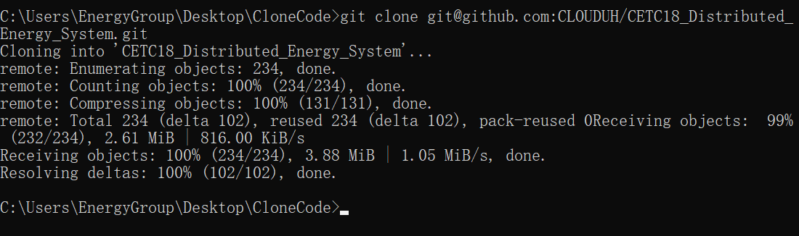

因为开放了权限，因此修改——提交——推送后，GitHub 上能够看到提交的改动

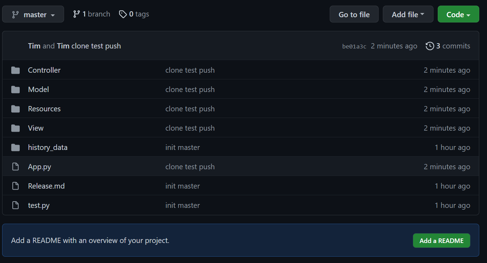

## 6 .gitignore 忽略缓存文件

.gitignore 可以避免把恶心的缓存文件以及历史数据 Push 到远程仓库

关于基本的.gitignore 编写规则，参考官方给出的 [github/gitignore](https://github.com/github/gitignore)

- 忽略文件夹 A ```A/```
- 忽略所有的.class 文件 ```*.class```
- 忽略 C 文件夹下的 B 文件 ```*C.B```

> 应注意，如果远程仓库已经含有.gitignore 中忽略的文件，请先删除远程仓库（可以删除本地的然后 Push 上去）

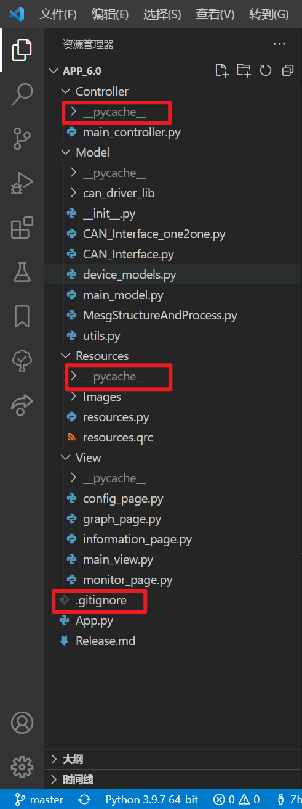

