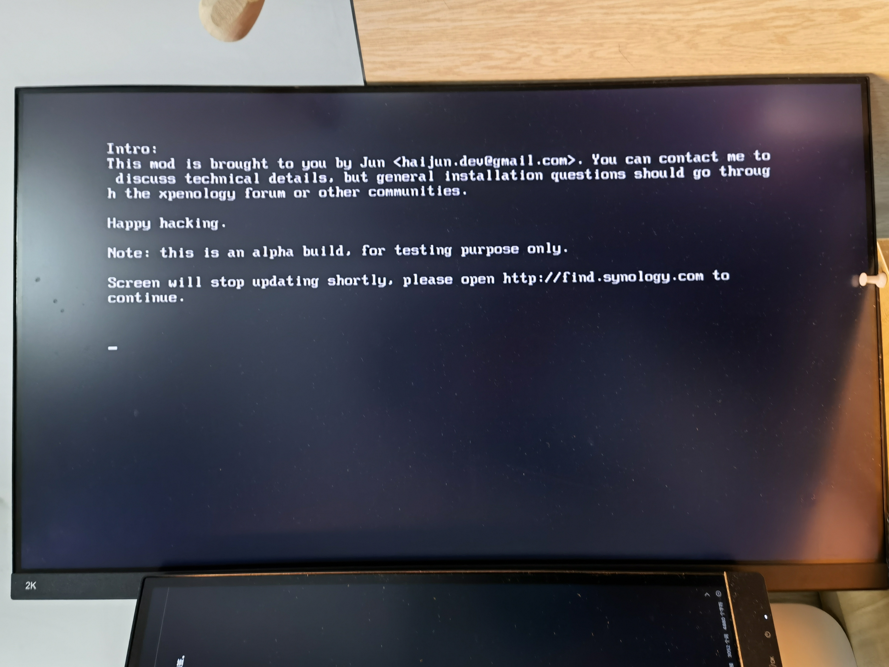

# 校园网黑群晖NAS搭建经验


我是一个喜欢把东西都按照条目整理好的人，从大学到现在，基本上所有重要的文件我都会按照自己的整理方式，分门别类地整理起来，方面后面的检索和管理。上了研究生后，随着个人数据量的不断增加，我也在不断思考如何继续存储日益增长的数据量，经过长达一个月的不断思考，我最终还是选择了组在校园网的环境下组建黑群晖NAS这一方案。

## Abstract

本文主要介绍我如何利用实验室闲置机箱组装黑群晖，通过配置黑群晖的各类软件以及配置其网络，最终实现个人本地 + 云存储的解决方案。

## 1 硬件选配

> 我当然想买一个白群晖，但是哪怕最便宜的DS220J，裸机也需要1400大洋。一块4T硬盘800左右，如果再痴心妄想一点组一个RAID阵列，那总价直逼3000大洋。因此，黑群晖成为了穷学生的最佳选择。

硬件是实验室分配的闲置办公主机，大概是三四年之前的联想的办公整机，加上双十一买入一块希捷酷狼4T硬盘，大体配置如下：

| 类别 | 型号/参数             | 价格 |
| ---- | --------------------- | ---- |
| CPU  | i5-7XXX               | 0    |
| 内存 | 4+8G                    | 0    |
| 存储 | 希捷 ST1000DM003 \*2      | 0    |
| 存储 | 希捷 ST4000VN008 酷狼 | 799  |
| 显卡 | GT9XX                 | 0    |

因为机箱里面理线过于奇怪，硬盘供电线长度很尴尬，所以索性把光驱的供电线和SATA线给拆了，然后把硬盘装在了机箱预留的螺丝孔里，其中一个老硬盘1T硬盘依旧放在硬盘架，另外一个硬盘嘛……我用双面胶和胶带捆在了光驱位……


我把机箱放在课题室桌子旁的角落里，日常使用过程中并没有察觉到噪音，只有在夜深人静的夜晚，才能勉强听到风扇和硬盘转动的声音。

截止目前为止，NAS已经正常运行四个月，最长一次开机为23天，没有出现过什么奇怪的问题。

受限于黑群晖的系统闲置和硬件水平，在日常使用上会有一些不方便的地方，而且其噪音和产生的电费也是一个很关键的问题，如果您是家庭或者宿舍使用，还是推荐入门更加简单的白群晖。

==推广链接==

## 2 黑群晖 Synology 的安装

群晖科技 Synology 是位于中国台湾省的一家企业，专注给提供不同规模的企业一个安全、高效率的数据管理系统，可以说是最广为人知的NAS提供商。

简单来说，白群晖就是你买到带有Synology LOGO的NAS机器，那黑群晖就是盗版的群晖，不是群晖官方认可的。

但是，有意思的是，**群晖公司对于黑群晖的态度很宽容**，并不全面禁止黑群晖的现象，甚至他们认为，使用过黑群晖的用户终将会转为白群晖用户。因此，只要黑群晖用户不做高危行为，基本上是可以一直使用的。

> 高危行为：通过某种手段更改设备SN，使其洗白为官方服务器可能认同的白群晖，并借此使用官方服务器所提供的QC服务。

黑群晖的安装教程网上有很多，本次安装主要参考一下连接：[手把手教您安装黑群晖918+ 6.2保姆级教程](https://post.smzdm.com/p/aqx07xmk/)

### 2.1 关于硬盘和磁盘阵列

硬盘和 RAID 阵列的选择取决于你所能安装的硬盘数量，需要提前看一下黑群晖主板上的硬盘线数量，包括 SATA3 和 M.2 的两种接口，配备相应的固态硬盘和移动硬盘。

RAID 阵列其实非常好理解，在 RAID 阵列下，多块硬盘通过你选择的方式进行数据冗余，可以避免一块硬盘损坏带来了的数据丢失问题。不同 RAID 的数据保护能力不同，且组成的容量和成本不同。对于平民玩家，RAID 不是一个经济实惠的方案，与其花钱买硬盘做冗余，还不如通过其他手段实现数据的多重备份。

常用的 RAID 阵列解释：

- Basic：其实不算阵列，就是一块硬盘当一块硬盘用
- RAID0：把多块硬盘组合成一块存储空间&数据分散在多块硬盘 无数据保护
- RAID1：把一块硬盘的数据无差别冗余在另一块上 昂贵但有效的保护
- RAID5：基于校验码的三硬盘以上的保护方案

还是不懂？来看看 Seagate 官方的 RAID 容量计算器：

[RAID 计算器 - 我需要多少容量？ | Seagate 中国](https://www.seagate.com/cn/zh/internal-hard-drives/raid-calculator/)


我硬盘是这样选择的：

- 两块 1T 硬盘 RAID0，主要用于 PT 下载盘
- 一块 4T 硬盘 Basic，主要用于存放重要数据

> 为啥不用两块 1T 的硬盘组 RAID1，或者再买块 4T 的组 RAID1 呢？一是因为两块 1T 的硬盘都超过上万小时了，而且第一次 SMART 检测的时候出现了坏道，我实在是不敢用它存放重要数据；再买一块硬盘嘛……也不是不想……关键是没钱买……

### 2.2 制作系统引导盘

引导 U 盘是需要长期插在主机上的，所以选择一个合适的 U 盘和合适的 USB 位，最好第一次安装的时候就确定好，安装成功后 U 盘就不要乱动了，不然说不定出现什么奇奇怪怪的问题。

我是使用的 DS3617 6.1.7 版本，据说是黑群晖使用最多的版本。如果你是带有集显的处理器，或许可以试试DS918 6.2版本，甚至如果你艺高人胆大的话，可以试试最新的7.0版本。

引导盘的制作的流程如下，详细的操作步骤请前文中的链接，本文不再赘述：

- 格式化 U 盘
- 查看 U 盘 PID 和 VID 值
- 修改引导文件中上述数值
- 将引导文件写入 U 盘中

**请注意，每次对 U 盘格式化和分区，其 U 盘的PID和VID信息都会改变，因此一旦安装失败重新格式化，请重新修改相关信息。**

### 2.3 调整磁盘启动顺序

引导 U 盘制作完成后，就可以插入到电脑上，然后进行黑群晖系统的安装。

在网上查找你主机主板进入 BIOS 的快捷键，在开机后疯狂点击进入 BIOS，如我这个主机的进入方法是 DEL 键。


进入BIOS后，找到 Boot Manager，将你的USB设备，拖到最高处


重启后，如果电脑显示如下界面，那恭喜你，可以把连在主机上的鼠标键盘和显示器拆掉了。



### 2.4 联机安装DSM

DiskStation Manager (DSM) 是专为 Synology NAS 打造的操作系统，安装 DSM 操作系统后，才能使用 NAS。

强烈建议在此步骤之前，在路由器管理软件上把NAS的IP地址固定住，比如我就设定为 192.168.104 只对应 NAS 的 MAC 地址，不会被 DHCP 分配给其他设备。

安装 DSM 需要通过群晖官方的 Synology Assistant 软件进行，主要是发现网络上的群晖设备，然后联机进行安装，通过官网下载即可。

[下载中心 - DS120j | 群晖科技 Synology Inc.](https://www.synology.cn/zh-cn/support/download/DS120j?version=7.0#utilities)


通过 Synology Assistant 查找局域网内的 NAS 设备，即可看到你的 NAS（我这里因为已经安装完了所以会直接显示版本号），然后点击进入安装页面。

**在第一次搜索的时候，SA是搜索不到NAS的，再点一下搜索就可以了。**


选择手动安装，选择 pat 文件，然后立即安装，等待安装即可。


如果它转了好久都没有安装成功，那可能说明你的引导盘配置有问题，或者你的DSM版本选择错误了，请回到上面重新尝试即可。

1. 创建管理员账户

如果你没有其他用户使用的打算，那管理员账户就足够你使用，你可以设置除了admin外更好记的名字。

2. 设置DSM更新和维护

请务必关闭自动更新！！！你永远不知道更新之后还能不能用

3. 黑群晖请跳过创建Snyology账户和QuickConnect的设置

当当～进入系统


## 3 黑群晖的基本设置

安装完成需要进行一些设置，才能让 NAS 得心应手，更适合我们的操作

### 3.1 设置存储空间和磁盘映射

如同我们之前在 Windows 中理解的概念：硬盘——分区——磁盘空间（C盘），在群晖中，首先要有**硬盘（HDD/SSD）**——设置**存储池（RAID Group）**，然后在 RAID 上建立**存储空间**，最后再建立**共享文件夹**，此处的共享文件夹才相当于我们之前理解的磁盘空间，在通过 MAC 和 WIN 添加映射的时候，也是以共享文件夹为单位的。

打开 DSM 中自带的**存储空间管理员**，即可看到你的存储信息


#### 3.1.1 设置 RAID Group

> 在新版本的 DSM 中，RAID Group 的名字叫做存储池

先查看一下你的硬盘，如果你不知道你的硬盘状态，建议点击状态信息，然后进行一次 SMART 检查，看一下有没有坏道；如果你是 Seagate IronWolf 系列NAS 硬盘，他们有除了 SMART 之外的一套检查方式，也可以运行一下。当然这会花费大量的时间，可以有时间再进行检测。


在 **RAID Group** 中点击**新增**，如果你要组建 RAID 阵列，请务必选择用于多个卷的 RAID Group，否则后续无法添加硬盘。然后选择你想要选择的阵列，然后拖动硬盘即可。


组建完之后就是这个样子：


#### 3.1.2 设置存储空间和共享文件夹

正如开头所说的，共享文件夹（磁盘映射）基于存储空间，存储空间基于RAID。

在**存储空间**里，**新增**存储空间，然后根据你的需求**配置容量**，稍等片刻，存储空间就建立好了。


然后此时你就可以关闭存储空间管理员的应用程序，来到控制面板的**共享文件夹设置**中，新增一个共享文件夹。


如果你勾选了**在网上邻居隐藏文件夹**，那么你在网络邻居上将看不到这个文件夹，这边建议把那些不常用的文件夹（如 MAC 时间机器自动创建的 Time Machine 文件夹）设置成不可见。

回收站也是建议必须开启的，你所有删除的东西都将移动至共享文件夹下一个名为 **\#recycle** 的文件夹内，防止手抖。

#### 3.1.3 在 MAC/WIN 上映射共享文件夹

如果你想在 MAC/WIN 上访问 NAS 上的共享文件，请务必保证**控制面板——文件服务——SMB——启动 SMB 服务**是开启的。

访问方法：

- 通过 NAS 的名字（如 SYNCLOUD）访问
- 通过 NAS 的IP地址（如192.168.1.104）访问


> 通过 NAS 名字方式访问的时候，由于防火墙设置的原因，可能会导致传输速度过慢，如果你介意这一点，建议直接通过 IP 地址连接。

MAC 上通过 Finder 直接访问 NAS，输入 NAS 管理的用户名和密码即可进行访问


WIN 上通过资源管理器中网络访问 NAS，或者在运行窗口中输入 ```\\NASNAME```，然后通过映射磁盘成磁盘符。


### 3.2 安装应用

群晖的功能强大在于其丰富的套件库，可以提供数不胜数的功能。更进一步地，使用 docker 安装更多的容器可实现软路由 / DDNS等功能。

#### 3.2.1 社群安装

但是由于我的网络问题，无法添加官方的社群库，因此在网上找到了其他的第三方社群实现了安装（并且自动安装UI）


#### 3.2.2 Transmission

Transmission 主要是用来下载PT资源的，是使用 NAS 不可获取的关键软件。Transmission 需要通过社群安装，而且需要通过端口（默认 9091）进行访问，需要设置相应的账户和密码。

Transmission 具有移动端的 UI，可以在手机进行远程查看。


#### 3.2.3 Plex 和 infuse

如果你使用 NAS，而且恰好拥有苹果的移动设备，就可以通过 Plex 和 infuse 两个工具实现刮削器和远程的视频观看。


群晖自带的 Video Station 也可以实现相应的功能，但是由于新的版本不支持杜比全景声，而且其刮削效果相较于 Plex 和 Emby，差很多……

Plex 的教程网上有很多，设置比较麻烦，可以根据自己的需求自行探索，配合上 infuse，不用支付高昂的费用，就能用的开心用的爽。


#### 3.2.4 docker 使用

如果想探索更多高阶的玩法，比如 DDNS 或者 软路由等功能，可以使用 docker 运行容器，实现这些功能。

当前我 docker 里面就跑了一个 DDNS，但是我的 IP 地址不是公网 IP，而是学校网络里拨号获取的 IP，所以我简单修改了一下代码，获取路由器拨号的 IP，然后用阿里云 DDNS 进行域名指向。


这是容器的 DDNS 日志。


## 4 网络配置

本人是在天津大学卫津路校区校园网环境下进行搭建，我们学校校园网的情况是这样的：

- 没有AP隔离（存在AP隔离会使得在校园网内无法访问NAS）
- 允许通过宽带拨号接入（如果只能通过Web认证就比较麻烦）
- 允许申请内网固定IP和外网固定IP（学生无权申请）

### 4.1 网络拓扑

我的基本思路就是通过路由器拨号，让我所有的设备都在一个局域网内，一方面不用再折腾所有设备的拨号问题，另一方面也是处于管理和安全的考虑，毕竟如果防火墙设置不当，同实验室的其他人可能就阴差阳错地访问到我的设备了。

Wi-Fi 其实可有可无，因为学校里面校园网无线基本全覆盖，通过 MAC 认证，基本上 iPad 和手机是时时刻刻都能连接到校园网的。但是通过 iPad 和手机在桌面上直接访问 NAS 还是需要 Wi-Fi 的，另一方面也是为了使用 DS Photo 的自动备份。


### 4.2 远程访问NAS

白群晖可以使用官方的 QuickConnect，以大致 10Mbps 的带宽远程访问自己的 NAS，黑群晖无法使用，且因为带宽太低，无法满足更加丰富的需求。

常规的解决方案就是拥有一个公网 IP，无论是静态 IP 还是动态 IP + DDNS 的模式，都能有效解决远程访问NAS的问题。

前文提到通过路由器拨号实现 NAS 连接校园网，因此在校园网没有 AP 隔离的情况下，可以通过如下几种方法来实现远程访问 NAS。

（1）校内访问：

- 申请校园网内网静态 IP，在校内直接通过 IP 访问
- 校园网内网动态 IP + DDNS，在校内通过域名进行访问
- 通过路由器远程软件查看拨号 IP，在校内直接通过 IP 进行访问

（2）校外访问

- 申请公网 IP，在校内校外直接通过 IP 访问
- 在校外通过 VPN 访问校园网，然后通过校内的方法进行访问


因为学生无法自己申请公网 IP 和内网静态 IP，所以我的解决方案是：**通过路由器远程管理软件查看 WAN 口拨号 IP，然后直接通过 IP 进行访问。校外通过 VPN 进行访问。**

现在也拥有了一个更加的解决方案：**通过校园 VPN 实现校外登陆校园网，校内通过 DDNS 解析路由器拨号得到的 WAN 口 IP 至自行购买的阿里云域名上，通过域名进行访问。**

#### 4.2.1 校内网络访问NAS

如果通过校园无线网或者有线网络进行连接，即设备与NAS（或路由器）在同一网段。天津大学只要连接上校园网并认证成功后，IP地址应该是172.20.XXX.XXX。

无论从校外还是校内访问NAS，都需要知道NAS的IP地址。但是没有静态IP，每一次拨号（或者账号掉线重连）都会使得路由器的IP地址产生变化。

**通过TP-LINK官方的路由器管理APP，查看当前WAN的拨号IP**


通过 DS File 软件进行访问


#### 4.2.2 校外 VPN 使用

通过校园VPN的方式进行链接。每个学校的校园VPN连接方式不一，可以咨询学校信息与网络中心进行申请。

> 在这里声明，校内 VPN 主要是学校为了向不在学校网络环境下的教职工和学生提供学术和工作服务用的，不提倡使用 VPN 传输大型文件的行为，这将会给学校 VPN 服务器带来很大的负担，侵犯其他教职工和同学的合法权益。


### 4.3 设置NAS端口转发

常用的几个端口：

- 5000: DSM的主界面
- 16881: Download Staion 和 Transmission（我自定义的）的传输端口
- 9091: Transmission 的管理界面，用于远程查看种子下载情况

平时用的比较多的就这几个，如果再有需要就再添加


### 4.4 设置路由器接口转发

端口转发是为了外部访问和 PT 资源下载，如果不设置的话，某些功能是无法远程访问的。

我使用的是 TP-LINK 的路由器，功能不全，但是足够使用了，在虚拟服务器中找到设置好相应的端口即可。

