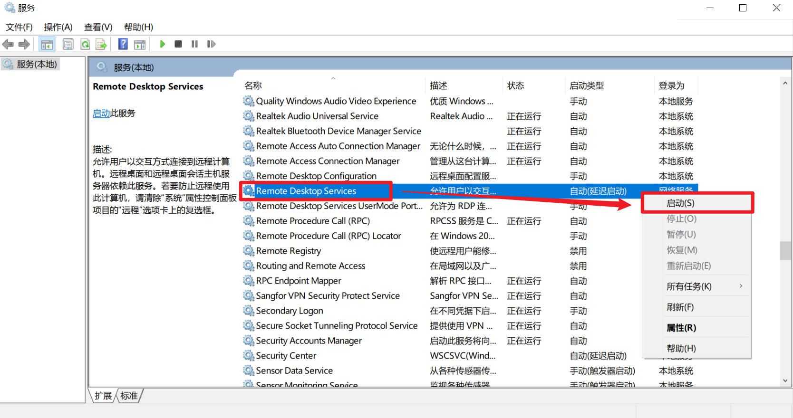
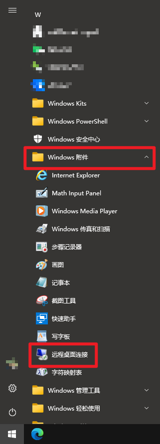

# 多客户端通过 Remote Desktop 连接 Windows10 家庭版电脑

## Abstract

本文主要介绍了如何通过Mac通过Remote Desktop软件连接局域网中的WIN10家庭版电脑，主要部分如下：

1. 通过RDR Wrapper软件实现WIN10家庭版远程桌面功能的开启
2. 设置WIN10远程设置和防火墙实现远程桌面端口的打开
3. 在Mac端通过Windows Remote Desktop软件连接WIN

整体体验：WIN自带远程控制优化了很多方面，减少了很多动画效果来提升流畅度，在千兆局域网内有线连接的分辨率也能达到4K 22Hz，吊打第三方远程连接软件。

## 1 WIN10家庭版远程桌面功能开启

### 1.1 在GitHub下载工具包

众所周知，WIN10家庭版的远程桌面功能被阉割了，普通用户无法通过基础设置实现远程桌面地连接，用户可以通过修改配置文件实现破解，或者按照本文的方式，通过GitHub上的RDP Wrapper工具实现远程桌面功能开启。

GitHub的工具下载：[GitHub - stascorp/rdpwrap: RDP Wrapper Library](https://github.com/stascorp/rdpwrap)

在Releases里最新的zip压缩包

解压后获得如下五个文件

### 1.2 安装并配置

（1）**右击install.bat通过管理员模式运行**，安装RDP Wrapper，默认会安装到C:\Program Files\RDP Wrapper，不建议你乱动和乱改。

（2）安装完之后，按任意键退出

> 这里因为我已经装完了，所以他会显示“already installed”

（3）**右击RDPConf.exe通过管理员模式运行**，检查三个条件是否都满足。

如果你打开之后是全是绿色的，则证明可以正常运行远程桌面

如果不是全绿的，则根据不同的情况进行设置，一般情况是下图这个样子（图是我P的），请按照各自的情况按照1.3节和1.4节的方式进行配置。

### 1.3 如果Service State非绿： 

打开**服务**窗口，把**Remote Desktop Service**服务手动开启

### 1.4 如果Listener State非绿：

需要寻找对应自己Service版本的ini文件，进行替换，替换后即可正常运行。

**请注意：替换dll文件需要暂时关闭Remote Desktop Services服务，请参考1.3的内容进行反向操作**

首先，进入RDP Wrapper仓库中的Issue：

[Issues · stascorp/rdpwrap · GitHub](https://github.com/stascorp/rdpwrap/issues)

在搜索框内键入版本号，版本号为Service State后的那一串数字

点开对应的Issues，找找大家的回复，一般能找到下载的链接，努力找找肯定是有的。

下载后，打开C:\Program Files\RDP Wrapper目录，将下载好的ini替换原本的。

记得按照1.3的步骤再次打开Remote Desktop Services，

**右击RDPConf.exe通过管理员模式运行**，如果显示绿色，则证明成功；若仍然显示“Not Supported”，则说明下错了文件，再去GitHub上检索一下。

### 1.5 打开远程协助功能

**打开控制面板——系统和安全——允许远程访问，勾选“允许远程协助链接这台计算机”**

**并在高级里勾选“允许此计算机被远程控制”**

### 1.6 最后的检查

**运行RDP工具包中的“RDPCheck.exe”**

弹出窗口，点击确定

如果出现如下窗口，则证明远程桌面被成功开启

## 2 设置WIN10防火墙

很多朋友设置完之后全绿，但是就是远程链接不上，主要原因是防火墙的限制把远程桌面的端口给禁用掉了，所以无法连接。

**打开控制面板——系统和安全——Windows Defender防火墙——高级设置——入站规则——新建规则**

添加一个端口的入站规则，类型选择TCP，端口填3389

保存退出即可。

如果你有通过公网IP或者域名访问的需求，请记得把路由器上相应的端口开放给WIN

> 如果过广域网远程连接的需求，建议修改为3389以外特定的端口，以保证您的数据安全

## 3 通过Remote Desktop软件连接

Remote Desktop提供了多个平台的软件可供使用，请按照自己的需要进行下载安装。

[远程桌面客户端 | Microsoft Docs](https://docs.microsoft.com/zh-cn/windows-server/remote/remote-desktop-services/clients/remote-desktop-clients)

### 3.1 通过Mac电脑进行连接

首先需要安装Microsoft Remote Desktop这个软件

由于区域限制，国区用户无法直接在App Store安装此软件，因此需要在网上下载dmg版本进行安装。这里推荐MacWK.com网站的安装包，还顺带提供了汉化包。

[Microsoft Remote Desktop 10.7.3 (1966) for Mac 微软windows远程连接工具](https://macwk.com/soft/microsoft-remote-desktop)

安装后，打开软件，添加一个PC

输入WIN的IP地址，添加用户账户

**请注意，这里的用户账户不一定是你电脑登陆的用户账户，请根据情况来判断**

- 如果是本地账户，直接输入开机登陆界面显示的用户名和登陆密码即可
- 如果是微软账户，输入您的微软账户邮箱地址和微软密码即可（就是你登录网页Office需要输入的账户和密码）
- 当然你也可以在WIN上创建一个新的账户，专门用于远程登陆使用

**请注意：通过唯一账户进行远程登陆后，WIN电脑上会被挤下来；若此时再通过WIN直接登陆，远程桌面则会被挤下来，但是操作的数据都还在。**

配置完成后，双击连接即可

关于一些设置的说明：

- 打开使用全部的显示器则会让远程桌面占用你现在使用的电脑的多个窗口，分辨率也会进行适配，如果不勾选的话，就默认一个显示器有分屏，如图：

> 就是分辨率有点鬼畜罢了，但是不影响使用

- 把颜色质量调低并打开Retina优化可以提高响应速度

- 请务必打开剪切板的共享，否则WIN和Mac的不同复制按键会把你逼疯……

> 对于远程连接用户，在域名/IP地址后面添加端口即可，如图

### 3.2 通过其他WIN进行连接

通过WIN连接远程桌面的方法相比于使用Mac连接更加稳定（可能是由于

WIN自带了远程连接这个软件，在**开始——Windows附件——远程桌面连接**

打开后连接也非常简单，输入IP地址，输入用户名，点击连接即可。记得勾选保存凭据，方便下次连接使用。

第一次连接要求输入密码，输入即可连接。

连接成功，这个分辨率还是很可人的。

### 3.3 用iPadOS/iOS连接

App Store里下载Remote Desktop这个软件即可

> 很奇怪为啥Mac上不能下载，反倒iOS/iPadOS上能够下载

操作步骤和3.1类似，不再赘述

下图是通过域名远程联机的效果，这个清晰度真的可以了。

### 3.4 使用Android手机进行连接

首先在Google Play里下载最新的Remote Desktop Client，截止发文时的最新版本是：10.0.13.1174

提供一个需要冲浪但是不用Google的下载链接（本来想放阿里云，但是文件禁止分享）

[APKMirror RD Client](https://www.apkmirror.com/apk/microsoft-corporation/microsoft-remote-desktop-preview/microsoft-remote-desktop-preview-10-0-13-1174-release/remote-desktop-10-0-13-1174-android-apk-download/download/)

登陆的操作还是同3.1，不再赘述

在手机上最好是调节一下分辨率（不要开启自适应分辨率，否则就会变成像我这样的长条形）

## 最后

最后在千兆局域网有线连接的情况下测试了一下显示效果，在Retina模式下，显示分辨率为3840\*2160(4K)，刷新率通过UFO Test测出来大概22Hz，足够使用了。

值得注意的是，虽然刷新率低，但是远程桌面实际上你的鼠标移动还是在Client完成的，因此移动鼠标不会感觉卡顿，只有在拖动和滚动的时候才能有比较明显的感知。

我我同样也测试了局域网外的连接方式：客户端——校园网VPN——通过域名访问WIN，分辨率略低于在局域网的效果（校园网+VPN带宽大概60Mbps），也完全足够使用了。

如果您觉得本篇文章有用的话，烦请点个赞收藏一下！