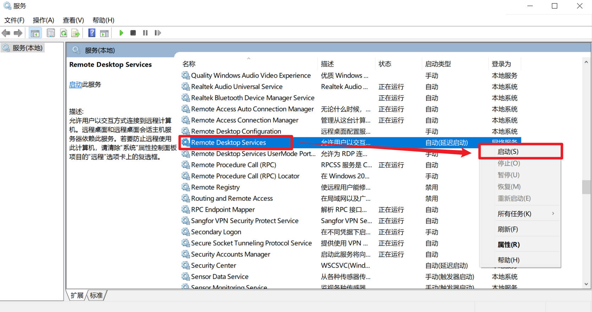
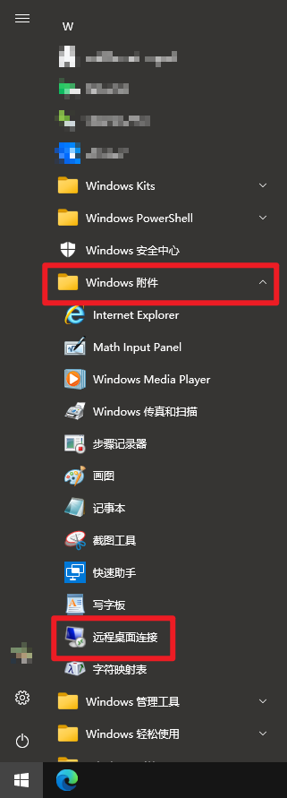

# 多客户端通过 Remote Desktop 连接 Windows10 家庭版电脑

## Abstract

本文主要介绍了如何通过 Mac 通过 Remote Desktop 软件连接局域网中的 WIN10 家庭版电脑，主要部分如下：

1. 通过 RDR Wrapper 软件实现 WIN10 家庭版远程桌面功能的开启
2. 设置 WIN10 远程设置和防火墙实现远程桌面端口的打开
3. 在 Mac 端通过 Windows Remote Desktop 软件连接 WIN

整体体验：WIN 自带远程控制优化了很多方面，减少了很多动画效果来提升流畅度，在千兆局域网内有线连接的分辨率也能达到 4K 22Hz，吊打第三方远程连接软件。

## 1 WIN10 家庭版远程桌面功能开启

### 1.1 在 GitHub 下载工具包

众所周知，WIN10 家庭版的远程桌面功能被阉割了，普通用户无法通过基础设置实现远程桌面地连接，用户可以通过修改配置文件实现破解，或者按照本文的方式，通过 GitHub 上的 RDP Wrapper 工具实现远程桌面功能开启。

GitHub 的工具下载：[GitHub - stascorp/rdpwrap: RDP Wrapper Library](https://github.com/stascorp/rdpwrap)

在 Releases 里最新的 zip 压缩包

解压后获得如下五个文件

### 1.2 安装并配置

（1）**右击 install.bat 通过管理员模式运行**，安装 RDP Wrapper，默认会安装到 C:\Program Files\RDP Wrapper，不建议你乱动和乱改。

（2）安装完之后，按任意键退出

> 这里因为我已经装完了，所以他会显示“already installed”

（3）**右击 RDPConf.exe 通过管理员模式运行**，检查三个条件是否都满足。

如果你打开之后是全是绿色的，则证明可以正常运行远程桌面

如果不是全绿的，则根据不同的情况进行设置，一般情况是下图这个样子（图是我 P 的），请按照各自的情况按照 1.3 节和 1.4 节的方式进行配置。

### 1.3 如果 Service State 非绿：

打开**服务**窗口，把 **Remote Desktop Service** 服务手动开启

### 1.4 如果 Listener State 非绿：

需要寻找对应自己 Service 版本的 ini 文件，进行替换，替换后即可正常运行。

**请注意：替换 dll 文件需要暂时关闭 Remote Desktop Services 服务，请参考 1.3 的内容进行反向操作**

首先，进入 RDP Wrapper 仓库中的 Issue：

[Issues · stascorp/rdpwrap · GitHub](https://github.com/stascorp/rdpwrap/issues)

在搜索框内键入版本号，版本号为 Service State 后的那一串数字

点开对应的 Issues，找找大家的回复，一般能找到下载的链接，努力找找肯定是有的。

下载后，打开 C:\Program Files\RDP Wrapper 目录，将下载好的 ini 替换原本的。

记得按照 1.3 的步骤再次打开 Remote Desktop Services，

**右击 RDPConf.exe 通过管理员模式运行**，如果显示绿色，则证明成功；若仍然显示“Not Supported”，则说明下错了文件，再去 GitHub 上检索一下。

### 1.5 打开远程协助功能

**打开控制面板——系统和安全——允许远程访问，勾选“允许远程协助链接这台计算机”**

**并在高级里勾选“允许此计算机被远程控制”**

### 1.6 最后的检查

**运行 RDP 工具包中的“RDPCheck.exe”**

弹出窗口，点击确定

如果出现如下窗口，则证明远程桌面被成功开启

## 2 设置 WIN10 防火墙

很多朋友设置完之后全绿，但是就是远程链接不上，主要原因是防火墙的限制把远程桌面的端口给禁用掉了，所以无法连接。

**打开控制面板——系统和安全——Windows Defender 防火墙——高级设置——入站规则——新建规则**

添加一个端口的入站规则，类型选择 TCP，端口填 3389

保存退出即可。

如果你有通过公网 IP 或者域名访问的需求，请记得把路由器上相应的端口开放给 WIN

> 如果过广域网远程连接的需求，建议修改为 3389 以外特定的端口，以保证您的数据安全

## 3 通过 Remote Desktop 软件连接

Remote Desktop 提供了多个平台的软件可供使用，请按照自己的需要进行下载安装。

[远程桌面客户端 | Microsoft Docs](https://docs.microsoft.com/zh-cn/windows-server/remote/remote-desktop-services/clients/remote-desktop-clients)

### 3.1 通过 Mac 电脑进行连接

首先需要安装 Microsoft Remote Desktop 这个软件

由于区域限制，国区用户无法直接在 App Store 安装此软件，因此需要在网上下载 dmg 版本进行安装。这里推荐 MacWK.com 网站的安装包，还顺带提供了汉化包。

[Microsoft Remote Desktop 10.7.3 (1966) for Mac 微软 windows 远程连接工具](https://macwk.com/soft/microsoft-remote-desktop)

安装后，打开软件，添加一个 PC

输入 WIN 的 IP 地址，添加用户账户

**请注意，这里的用户账户不一定是你电脑登陆的用户账户，请根据情况来判断**

- 如果是本地账户，直接输入开机登陆界面显示的用户名和登陆密码即可
- 如果是微软账户，输入您的微软账户邮箱地址和微软密码即可（就是你登录网页 Office 需要输入的账户和密码）
- 当然你也可以在 WIN 上创建一个新的账户，专门用于远程登陆使用

**请注意：通过唯一账户进行远程登陆后，WIN 电脑上会被挤下来；若此时再通过 WIN 直接登陆，远程桌面则会被挤下来，但是操作的数据都还在。**

配置完成后，双击连接即可

关于一些设置的说明：

- 打开使用全部的显示器则会让远程桌面占用你现在使用的电脑的多个窗口，分辨率也会进行适配，如果不勾选的话，就默认一个显示器有分屏，如图：

> 就是分辨率有点鬼畜罢了，但是不影响使用

- 把颜色质量调低并打开 Retina 优化可以提高响应速度

- 请务必打开剪切板的共享，否则 WIN 和 Mac 的不同复制按键会把你逼疯……

> 对于远程连接用户，在域名/IP 地址后面添加端口即可，如图

### 3.2 通过其他 WIN 进行连接

通过 WIN 连接远程桌面的方法相比于使用 Mac 连接更加稳定（可能是由于

WIN 自带了远程连接这个软件，在**开始——Windows 附件——远程桌面连接**

打开后连接也非常简单，输入 IP 地址，输入用户名，点击连接即可。记得勾选保存凭据，方便下次连接使用。

第一次连接要求输入密码，输入即可连接。

连接成功，这个分辨率还是很可人的。

### 3.3 用 iPadOS/iOS 连接

App Store 里下载 Remote Desktop 这个软件即可

> 很奇怪为啥 Mac 上不能下载，反倒 iOS/iPadOS 上能够下载

操作步骤和 3.1 类似，不再赘述

下图是通过域名远程联机的效果，这个清晰度真的可以了。

### 3.4 使用 Android 手机进行连接

首先在 Google Play 里下载最新的 Remote Desktop Client，截止发文时的最新版本是：10.0.13.1174

提供一个需要冲浪但是不用 Google 的下载链接（本来想放阿里云，但是文件禁止分享）

[APKMirror RD Client](https://www.apkmirror.com/apk/microsoft-corporation/microsoft-remote-desktop-preview/microsoft-remote-desktop-preview-10-0-13-1174-release/remote-desktop-10-0-13-1174-android-apk-download/download/)

登陆的操作还是同 3.1，不再赘述

在手机上最好是调节一下分辨率（不要开启自适应分辨率，否则就会变成像我这样的长条形）

## 最后

最后在千兆局域网有线连接的情况下测试了一下显示效果，在 Retina 模式下，显示分辨率为 3840\*2160(4K)，刷新率通过 UFO Test 测出来大概 22Hz，足够使用了。

值得注意的是，虽然刷新率低，但是远程桌面实际上你的鼠标移动还是在 Client 完成的，因此移动鼠标不会感觉卡顿，只有在拖动和滚动的时候才能有比较明显的感知。

我我同样也测试了局域网外的连接方式：客户端——校园网 VPN——通过域名访问 WIN，分辨率略低于在局域网的效果（校园网+VPN 带宽大概 60Mbps），也完全足够使用了。

如果您觉得本篇文章有用的话，烦请点个赞收藏一下！
