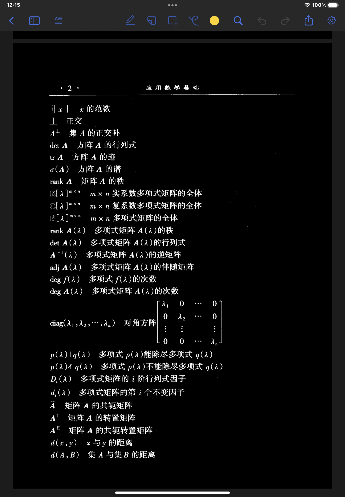

# 利用群晖 NAS 中的 WebDAV 服务实现 Zotero 的文献同步

## Abstract

本文主要介绍如何在文献管理软件Zotero中使用群晖NAS中的WebDAV功能，以实现文献同步，关键点如下：

- 开启Synology NAS中的WebDAV服务以及开放相应端口
- 使用本地IP地址 / 已有证书的域名的域名进行访问
- Mac / Win / iOS端配置

## 1 看不懂标题的同学看这里

### 1.1 什么是WebDAV？

> WebDAV （Web-based Distributed Authoring and Versioning） 一种基于 HTTP 1.1协议的通信协议。它扩展了HTTP 1.1，在GET、POST、HEAD等几个HTTP标准方法以外添加了一些新的方法，使应用程序可对Web Server直接读写，并支持写文件锁定(Locking)及解锁(Unlock)，还可以支持文件的版本控制。

简单来说就是一种网络同步协议，能够实现比较方便的信息同步功能。国内做的最好的公有WebDAV同步盘是**坚果云**，免费版提供每个月最多1GB的上传量和3GB下载量，空间不受限；付费版空间30G起步，流量不受限（年付有加成，比如我现在最大59GB）

### 1.2 什么是Zotero？

Zotero官方：[Zotero | Your personal research assistant](https://www.zotero.org/)

> Zotero是一款自由及开放源代码的文献管理软件，管理书目信息（如作者、标题、出版社、摘要、阅读笔记等）及相关材料（如PDF文件等)。其最著名的特性是作为浏览器插件、在线同步、与文档编辑软件如Microsoft Word、LibreOffice、OpenOffice.org Writer、NeoOffice等集成，可生成文内引用、生成页面脚注或文后的参考文献（bibliographies）。

Zotero提供了Windows / MacOS / Linux / iOS的客户端，均可直接下载使用，安卓版可以使用zoo for zotero进行替代。

Zotero提供了200MB的官方免费同步空间，对于轻量化阅读文献的同学来说，应该是足够用的，但是参考一部电子教材的大小就可能达到100MB，官方提供的空间明显是不够用的。

但与此同时，也提供了第三方的WebDAV服务设置，你可以在设置中添加你私有的WebDAV地址 / 账户 / 密码，对此，坚果云帮助文档中有详细的说明。

[坚果云使用 Zotero 配置过程详解 | 坚果云帮助中心](https://help.jianguoyun.com/?p=4190)

关于如何使用坚果云和Zotero高效地学习，在我另一片文章中有所介绍，此文章已经被坚果云官方推送，欢迎大家阅读。

[https://mp.weixin.qq.com/s/Q2uYIpMl_3yx6dhr5KpsuQ](https://mp.weixin.qq.com/s/Q2uYIpMl_3yx6dhr5KpsuQ)

### 1.3 为什么要用NAS呢？

因为我恰好有NAS，我恰好有域名，也恰好坚果云快到期了。

另外，对于拥有NAS的服务器的学生们，可以一群人免费使用。

## 2 开启WebDAV服务

首先在群晖的套件中心安装WebDAV服务器

安装完成后，打开WebDAV Server，开启HTTP 和 HTTPS端口

> 端口可以任意配置，但是前提是你得记得住

设置路由器的端口转发，这里以TP-LINK路由器为例

此时此刻，你的WebDAV服务器就已经开启了，然后就是账户配置

你当然可以使用你管理员的账户，但是我不建议这样做，因为安全性堪忧；因此这里我新建一个专门用于webdav同步的账户，密码由系统随机生成。权限设置为只能访问特定文件夹。

## 3 使用本地IP / 证书域名进行访问

此章节涉及一些“高阶操作”，非admin用户可以直接跳到第四章。

### 3.1 无域名的用户

如果你只是在局域网内使用，比如家庭、宿舍或者实验室网络，NAS的IP地址默认是固定的，那么假定你的信息如下：

NAS地址：192.168.1.100
WebDAV端口: 5005(http) / 5006(https)
账户：zotero
密码：123456
可访问的文件夹：/home

### 3.2 有域名的用户申请证书

假定你已经通过DDNS功能或者通过公网IP将你NAS的地址已经指向了你的域名，如果你不知道如何操作的话，我有一篇文章中有所介绍。

这里注意：由于系统安全性限制，只能够通过HTTP协议访问本地的WebDAV服务器，或者通过HTTPS协议访问有安全证书的网络WebDAV服务器。

> [iOS: Can't connect to WebDAV server - Zotero Forums](https://forums.zotero.org/discussion/92958/ios-cant-connect-to-webdav-server): non-local HTTP connections won't work, and won't be configurable in future versions. You need to use HTTPS or a local HTTP connection. 

简单来讲，你无法通过HTTP端口访问广域网的WebDAV服务器，只能通过HTTPS协议访问**带有SSL安全证书的WebDAV服务器**

因此，申请SSL证书，这里以阿里云为例子。

打开阿里云官方，找到数字证书管理服务（SSL证书），链接：

[证书服务_SSL数字证书_HTTPS加密_服务器证书_CA认证-阿里云](https://www.aliyun.com/product/cas)

点击选购SSL证书

选择**DV单域名证书**，数量选择**20**，阿里云的政策：每个实名主体个人/企业，一个自然年内可以领取一次数量为20的云盾单域名试用证书。我这里已经买过了，所以显示灰色。

购买成功后，前往数字证书管理服务的控制台，选择**SSL证书**，选择**免费证书**，选择**创建证书**

创建之后，会弹出新的证书项目，选择**证书申请**，填写你的域名和你的信息，其他的都默认即可。

然后下一步，验证DNS即可提交审核，前提是你必须把你的域名已经配置好DNS信息

等上大概10分钟，证书应该就签发下来了，这时下载证书即可，类型选择**其他**

下载之后有两个文件，pem是密钥，key是证书

### 3.3 添加证书至NAS

打开**控制面板**，打开**安全性**，选择**添加新证书**

选择**导入证书**

上传刚刚下载的两个文件，中间证书不用管

完成之后，点击配置，把WebDAV服务器选择为刚刚新增的证书

好了，所有的事情就完成了，假定你设置好之后是：

NAS域名：www.abc.com
WebDAV端口: 5005(http) / 5006(https)
账户：zotero
密码：123456
可访问的文件夹：/home

> 这里注意，/home文件夹是每一个被分配到群晖账户的用户都有的，因此团体使用的时候，zotero的WebDAV文件也基本上需要存储在这里，不建议管理员建立专门的共享文件夹进行存放，否则大家的文件都会混在一起。

## 4 配置各个客户端

### 4.1 MacOS & Windows

打开首选项，输入WebDAV服务器信息

以第三部分假定的服务器信息为例：

URL: https://www.abc.com:5006/home/zotero/
用户名: zotero
密码: 123456

**一定要选择https！！！，端口一定要是5006！！！**

> 如果你不想放在/home文件夹的根目录，你可以直接在/home文件夹后面添加你想要存放的目录位置，例如：/home/appdata/Zotero。zotero会在上述目录下建立一个zotero文件夹。

点击验证服务器，提示操作成功

然后记得，点一下更新

稍等一会，Zotero的文献附件就同步过去了。如果没有同步的话，就等一等，或者重启软件，反正早晚就能用了。

> zotero的同步文件是乱码，这个是软件的设置，没有办法更改，就不要管他了

### 4.2 iOS

是的没错，Zotero也提供了iPad版本，配合NAS所带的WebDAV功能，哪怕你没有公网IP，也可以在校园网的环境下随时随地使用iPad看文献了（前提是域名指向了你校内的IP）

填写的内容还是类同于4.1节，填写完成后点击验证服务器即可完成

iPad阅读效果如下，提供黑暗模式，还是挺不错的。

