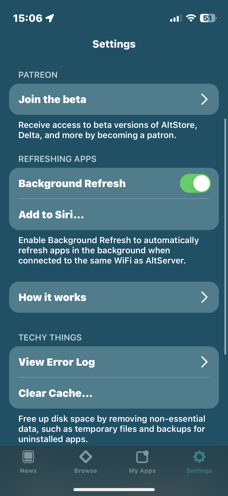
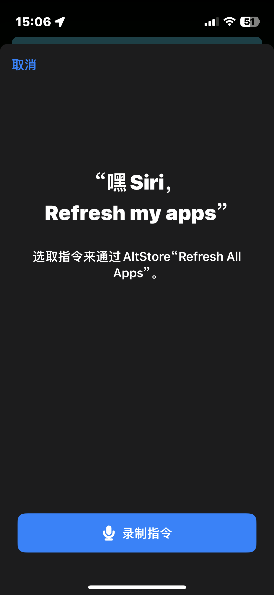
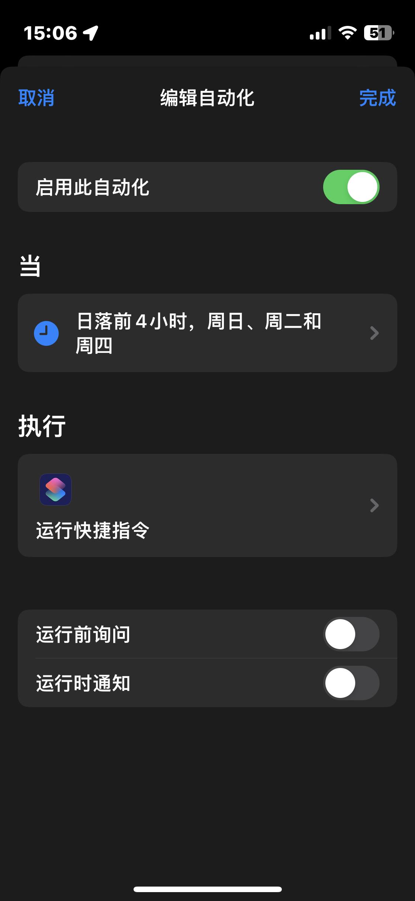

# 使用 AltStore 实现 iOS 微信双开


## Abstract

本文介绍了如何通过 AltStore 自签名实现 iOS 微信双开，首先介绍了如何安装 AltStore 和 AltServer 软件，随后说明了 IPA 砸壳安装包的获取方式以及为了避免 URL 冲突而做出的代码修改，最后实现了 iOS 的微信双开以及后台的自动更新。

优点：完全免费、不用担心数据安全、可以自动更新
缺点：操作稍微复杂、单次更新最多使用7天、更新需要有电脑在身边。

## 1 电脑端安装 AltServer

关于 AltStore：

> AltStore 允许您仅使用您的 Apple ID 将其他应用程序（.ipa 文件）旁加载到您的 iOS 设备上。 AltStore 使用您的个人开发证书重新注册应用程序，并将它们发送到桌面应用程序 AltServer，后者使用 iTunes Wi-Fi 同步将重新注册的应用程序安装回您的设备。为防止应用程序过期，AltStore 还会在与 AltServer 处于同一 Wi-Fi 时在后台定期刷新您的应用程序。

本文目前以 macOS 为例，后续有时间更新 Windows 系统版本。

官方提供了安装教程：[How to Install AltStore (macOS) - AltStore](https://faq.altstore.io/getting-started/how-to-install-altstore-macos)

### 1.1 下载安装

官方提供了 macOS 和 Windows 两个版本，根据自己的需求进行下载安装，本篇文章以 macOS 为例子。官网下载链接：[Welcome to AltStore](https://altstore.io/) 

下载安装完成后，AltServer 没有应用程序主界面，在电脑右上角的状态栏，能找到一个小小的图标。


### 1.2 安装邮箱插件

AltServer 需要安装一个邮箱插件，直接安装即可。


安装完成之后无法直接使用，需要打开邮箱客户端配置下，打开**邮箱-偏好设置**


找到**通用-管理插件**，勾选 **AltPlugin.mailbundle**，然后**应用并重启邮件**


> 第一次安装 AltStore 和后续更新时，必须要保证邮件客户端处于打开（后台运行）的状态，否则无法进行安装和更新。

### 1.3 连接 iPhone 安装 AltStore

使用数据线连接 iPhone 至电脑，点击菜单栏的 AltServer 图标， 点击**Install AltStore...**


这里会要求输入您的APPLE ID和密码，大胆的输入，没问题的。


## 2 设置 iPhone 端 AltStore

安装完成之后，手机上会出现 AltStore 这个软件，因为一些安全限制，此时是无法打开的，需要信任设备并打开开发者模式。

### 2.1 信任开发者

打开**设置-通用-VPN与设备管理**，点击设备信任即可。


### 2.2 启动开发者模式

另外需要打开开发者模式，**设置-隐私与安全性-开发者模式**。


### 2.3 登陆 AltStore

完成之后，AltStore 就可以正常打开了，输入账号密码登录 Apple ID。


## 3 获取微信 IPA 文件

安装之前需要获取微信的安装包，理论上你是找不到微信的 IPA 安装包的，因为所有 iOS 软件的发行是通过 App Store 的，有自行折腾和网络获取两种方式，这里重点介绍如何获取安装包，自行折腾的砸壳方式不做具体介绍。

### 3.1 IPATool 自行砸壳

本方法是基于终端操作的，通过 HomeBrew 安装工具，然后完全通过命令行进行下载。

[GitHub - majd/ipatool: Command-line tool that allows searching and downloading app packages (known as ipa files) from the iOS App Store](https://github.com/majd/ipatool)

默认你已经安装了 HomeBrew，通过命令行安装 IPATool

```shell
brew tap majd/repo
brew install ipatool
```

登陆账户，会收到一个验证码

```shell
ipatool auth login -e <appleId> -p <password>
```

下载你需要的包，注意这里的名字不是微信的名字，而是对应的 bundleId。

```shell
ipatool download -b <bundleId>
````

例如，微信就是 `com.tencent.xin`，输入命令就可以下载安装包到电脑中。

**这个安装包是不能直接使用的，需要进一步砸壳才能使用**

### 3.1 白嫖已有资源

这个网站的安装包是我觉得最良心的，提供的微信 IPA 基本上是纯净版，已经帮我们删掉了 WatchKit 和 Plugin 等影响安装的文件。不想折腾的小白就直接点这个下载吧。

[DumpApp 网盘](https://pan.dumpapp.com/)


## 4 修改 IPA 代码*

如果直接拿上述的 IPA 安装包安装第二个微信的话，由于 API 和 URL Scheme 的冲突，会出现一些问题：

- 无法通过快捷指令打开 URL 调用微信扫一扫（会跳转到第二个微信中）。
- 无法将小程序的快捷方式添加到桌面（会跳转到第二个微信中）。
- 所显示的名字无法自定义。

如果你认为这些都无伤大雅的话，可以跳过这一章。

### 4.1 解压

假设你手中待安装的 IPA 文件名为：**微信_8.0.38-2.ipa**

将该文件的后缀强制改名为：**微信_8.0.38-2.zip**，然后解压，即可得到一个文件夹：**Payload**。


进入 **Payload** 文件夹中，然后在 **WeChat.app** 上右击鼠标，点击 **显示包内容**。


### 4.2 删除

删掉几个关键的文件夹，如果没有的话可能砸壳的人已经帮你删掉了：

- Watch
- WatchKit
- Plugins
- com.apple.WatchPlaceholder

### 4.3 修改

使用 Xcode 或者任意的 IDE （比如 VS Code）打开 **info.plist** 文件，修改几个关键值。

- CFBundleDisplayName: 微信 --> DeChat
- CFBundleIdentifier: com.tencent.xin --> com.tencent.dechat
- CFBundleURLName: com.tencent.xin --> com.tencent.dechat
- CFBundleURLSchemes: weixin --> dechat


### 4.4 打包

将 **Payload** 文件夹压缩，然后改后缀为 **.ipa**。

将此文件传输到手机上，保存到任意位置即可。

## 5 安装第二个微信

点击 AltStore 左上角，选择 IPA 文件进行安装


首次安装直接选择 **Remove App Extensions**，因此拓展也会占用额外的签名，如果你不懂我说的什么意思，那就直接点击去除吧。


完成后，桌面就会出现新的 WeChat 图标，即安装成功。


## 6 设置自动更新签名

由于签名的有效期只有 7 天，因此需要设置自动更新来实现后台的自动刷新。

- 安装 AltServer 的电脑和 iPhone 必须在同一个无线下（或者有线连接）
- 电脑必须开启邮件客户端
- 更新是非实时的，建议通过快捷指令定期实现

### 6.1 在 AltStore 里开启后台刷新（不推荐）

在设置中可以将 **Background Refresh** 开启，开启后，可以实现自动后台刷新 APP，但是问题是，可能这个刷新不会那么及时和准确，所以我更推荐使用快捷指令进行定时刷新。



### 6.2 通过快捷指令定时进行刷新

在设置中，点击**Add to Siri** ，添加快捷指令。



在快捷指令库里，设置一个自动化，这个根据个人的习惯来，因为我基本上每天都离在电脑旁边，因此设置了日落前4小时内自动触发。

