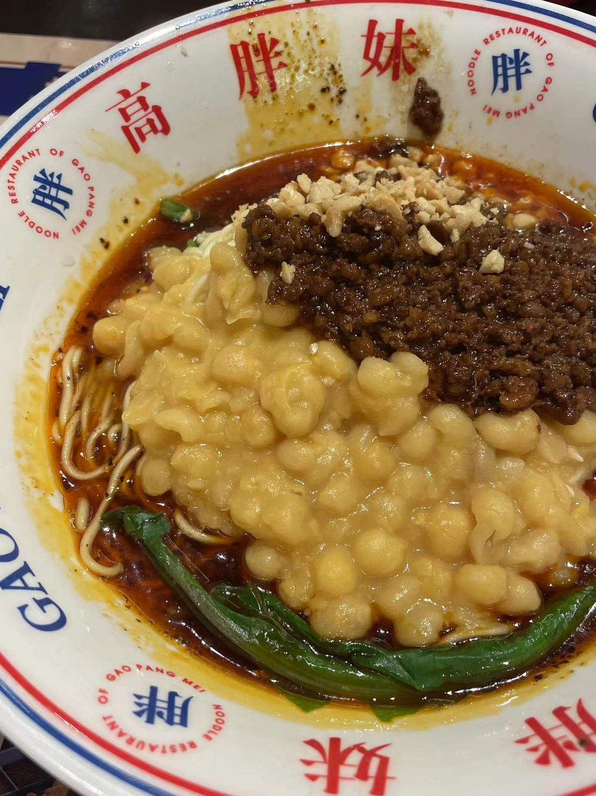

# 赣味餐厅 高胖妹面庄 茶话弄

原本计划抓紧时间把材料和论文搞完，但是难得睡了一个好觉，醒来已经是九点多了。坐在窗边想了想：本身就是可以放松的周末，如果这个时候不好好地放空自己，难道又要在工作日摸鱼防水搞恶性循环吗？于是喊了朋友，一起出门探店去了。

朋友和我都是嘴刁的主，很喜欢去味道不错的饭馆探店，时常还会找些压根没吃过的地方尝尝鲜。因为都是外地求学，没有本地人的引导，地道而且小众的馆子也不好找。我们寻找一家味道不错饭店的方式，基本是看大众点评上的必吃榜。如果一家餐厅上榜了，虽然不能保证它是一顶一的好吃，但是至少不会太差。

今天吃到的东西都还不错，也顺便看了一场不错的电影。心血来潮，打算记录记录这些吃过的美食，也算是动动好久没码过字的手，看看能不能养成个好习惯。唯一可惜的是，因为白天没能想到记录，所以没怎么拍照片，这次就凭着脑海中的记忆，凑活着写吧。

## 1 赣味餐厅

午餐我们就选在了位于哈尔滨道上的赣味人家，一家面积不大的江西菜夫妻店。这间店很早之前就想来吃了，奈何时间一直不太合适，再加上滨江道离朋友实在很远，所以一直没能品鉴成功。今天时间充裕，我扫上共享单车，骑车就去了。

两个人总共花了 132 元，让老板抹零 130 元，人均 65 元。菜量中规中矩，算不上太大，两个人吃了 3 个菜和 2 个瓦罐汤，再加一人一碗米饭，吃了个八分饱。如果是只吃味了吃饱，只点拌饭的话，人均应该能压到 30 元左右。

我们的菜单：

- 井冈山烟笋 30 元
- 干锅带皮牛肉 48 元
- 外婆菜炒鸡蛋 28 元
- 白萝卜排骨瓦罐汤 12 元
- 茶树菇老鸭瓦罐汤 15 元

### 1.1 井冈山烟笋

炒烟笋在很多湘菜馆都吃过了，虽然没了解过具体制作工艺，但是从口味可以猜出来，应该是将新鲜的竹笋通过烟熏的方法，赋予其特殊的口味和脆韧的口感。

赣味人家的炒烟笋显得别具一格，里面只有常规的山芹和红椒，并没有加任何的肉。可能是为了迎合北方的口味，选用的红椒并不辣，辣味的主要来源还是油煸过的干辣椒。选用的山芹非常新鲜，并且整盘菜中也没有见到粗大的茎根和细碎的叶片，都是使用了靠上的细茎和嫩芽。烟笋的口感非常的脆嫩，没有预包装烟笋的那种老道，大概是老板有专门的进货渠道，采购的新鲜烟笋。

之前吃过的烟笋往往是配着腊肉一起炒制，通过热油将腊肉的风味煸制出来，然后再沁入水分持续减少的烟笋中。这次吃的单炒烟笋，倒是很特别，仔细品尝，是能尝到食材的新鲜的。

### 1.2 外婆菜炒蛋

本来想点黎蒿炒腊肉，但是老板说黎蒿这个季节没有，所以我们换成了外婆菜炒蛋。外婆菜据说是选用梅干菜、萝卜干等小菜炒制而成的，放了少许的葱花和红椒。鸡蛋的火候较大，都是煎到金黄再混到一起炒。

外婆菜吃起来脆脆的，口感很像腌制的萝卜丁，整体不算太辣。这个菜唯一的问题是吃起来太麻烦，筷子夹不到，只能拿起勺子一勺一勺地往碗里挖。

### 1.3 干锅带皮牛肉

这个菜的价格是最贵的，但也是我最喜欢的一道菜，可能是菜量本身不大的原因，里面的牛肉占了很大一部分。这个菜一定要趁热吃，所以老板给上了一个干锅灶，放了两个酒精块在下面加热。

配菜还是老相识山芹，和牛肉搭档，他们两个总能焕发出一些新奇的味道。这道菜的牛肉是提前卤好的，牛肉处理的很嫩，配上 Q 弹的牛皮，口感刚刚好。整体的风味很像卤香牛肉面的方便面调料，大概是放了许多的五香粉和味精。

### 1.4 瓦罐煨汤

我们选择了两个瓦罐，茶树菇老鸭和白萝卜排骨。两个汤都是在大瓮里面现取出来的，像是从早到晚闷了很久，味道都非常的足。虽然汤很清澈，但是能都能尝到新鲜食材融入其中的味道。白萝卜的辛辣与脱骨的排骨，茶树菇的鲜甜与嫩滑的鸭肉都让味蕾得到了满足。

## 2 茶话弄

本来想去排霸王茶姬，但是排号的人太多，于是选择了去恒隆里面找了一家茶话弄，点了两杯奶茶。我点了我钟爱的茉莉花茶系列，朋友点了金骏眉系列。

茶话弄的口感很像之前喝过的茶颜悦色，都是这种古朴手绘中国风的设计。口感也非常像，浓浓的茶香配上淡淡的鲜奶，最后打上厚厚的动物奶油，有些幽兰拿铁的感觉。把奶油搅拌进茶中，用搅拌棒设计的吸管喝非常巴适。只不过喝到最后的时候，会剩下大量的奶油泡沫，单喝起来不仅费劲，而且特别容易腻。

如果一定要给女生带一杯奶茶的话，茶话弄的金骏眉和茉莉花我可能会选择一个。两杯奶茶都是 18 块钱，但是具体的品名忘记了。

## 3 高胖妹面庄

本来不想吃太辣的东西，奈何一直没有找到称心如意的简餐，也恰好走到了高胖妹附近，于是就直接进去点了碗杂面。

碗杂面之前没有吃过，之前一直以为是硬硬的黄豆配上硬硬的面条，今天去吃了一下，发现自己之前的想法确实不对。黄豆被煮到软烂，远远看上去像是软软的玉米糊。炸过的肉末配上卤制的酱油，大勺放入碗中。面条是让我有点意想不到的，粗细非常均匀，像是那种圆形的挂面煮到8分熟捞出来，口感不夹生但是比较硬。最后浇上红油和少许花生碎，就成了这一碗碗杂面。

作为一个北方人，我倒是觉得，面的选择可能没有达到我的预期。因为虽然面上的很快，但是面条已经成为了一坨。如果能够选用更加劲道的面条，再通过过凉水的方式将面的温度降下来，口感可能会变更好。

除此之外，我们还点了焦糖豆花、炸小豆腐作为小菜。焦糖豆花的口感很不错，但是我觉得它的制作方法就是使用豆奶粉加了些吉利丁片冷却做成的，口味和维维豆奶几乎无差。炸豆腐也是选用了市面常见的包浆豆腐，配上一些辣酱和牛肉酱，不算惊艳，但也不算难吃。

好了去写奥本海默的影评了～
