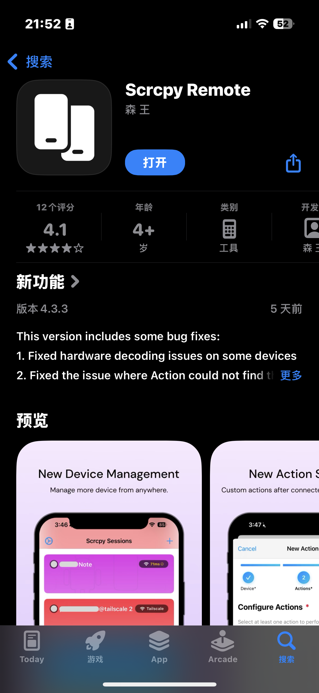

# 利用 Scrcpy 远程远程使用微信

## Abstract

懒得骂某些软件了真的

## 1 设置端口

### 1.1 安装 iSH

在 iPhone 的 App Store 搜索并安装 iSH


安装 ADB 包 

```shell
apk add andriod-tools
```


> 我这里安装过了所以不太一样

### 1.2 开启安卓无线调试

>  在每一次安卓手机重启时都要重新配置，内外网无所谓，都是改一个东西

开启 USB 调试和无线调试

打开无线调试，选择“使用配对码匹配设备”


- 设备 IP：192.168.1.91
- 配对接口：aaaaa
- 匹配码：BBBBBB
- 连接接口：ccccc

### 1.3 更改端口

配对设备

```shell
adb pair 192.168.1.91:aaaaa
```


输入配对码，完成配对


连接安卓手机

```shell
adb connect 192.168.1.91:ccccc
```


修改无线调试端口号

```shell
adb tcpip 5555
```

> 建议 5555 是因为最早安卓的默认 ADB 端口就是 5555


到此就可以退出 iSH 应用了，只要安卓不重启，就不用再进入这个软件。

## 2 设置 Tailscale 和端口转发

### 2.1 Tailscale 设置

登陆 Tailscale，注册一个账户，注册过程略

[Tailscale · Best VPN Service for Secure Networks](https://tailscale.com/)

在安卓和 iOS 上均下载 Tailscale


> iOS 需要外区账号，可以淘宝搜一下。安卓需要更改 Google 商店地区，可以用第三方应用商店进行下载。

在各自的设备登录之后，进入 Tailscale 官网把 IP 改一个好记的


如果要长时间使用 Tailscale 的话，记得在后天锁定，并关闭电池优化。


电池—查看详情——Tailscale——后台运行——选择“不受限制”


### 2.2 公网路由器设置

> 博主是校园的大内网，所以直接暴露出来了。


假设此时此刻的域名和 Tailscale IP 为：

- 公网域名： www.sbwechat.com
- 公网端口：5555
- Tailscale IP：100.105.105.105

## 3 Scrcpy 连接

### 3.1 安装并配置 Scrcpy Remote

> 国区现在应该是没有了，美区 2.99 美元，直接 Pockty 买点卡充了。



登陆 Tailscale，获取一个 Auth Key：

[Tailscale](https://login.tailscale.com/admin/settings/keys)


设置一个方便记的名字，Reusable 开不开都行（看你懒不懒）


打开设置，选择配置 Tailscale 认证，输入 Auth Key，点击 Connect & Test Tailscale 进行测试。


### 3.2 添加配对并更新 ADB 密钥

打开设置，选择“使用配对码进行 ADB 配对”


> 配对后不会失效，只不过每次 Connect 端口会变

- 地址：192.168.1.91:aaaaa
- 配对码：BBBBBB


回到设置界面，选择“管理 ADB 密钥”

在每次安卓重新启动，点击“生成新的密钥对”


### 3.3 添加连接

- 输入名字、abd 地址和端口号
- 如果是填写了 Tailscale IP 的话记得勾选“通过 Tailscale 连接”
- 编码格式可以选择“h.265”，更加高效
- 勾选“连接后关闭远程屏幕”和“断开后关闭远程屏幕”
- 保存回话即可


点击就可以进行链接了


这里可能会黑屏，是因为要输入密码。点击右下角选择小键盘输入密码，再点击“return”就能进入了。


### 3.4 免输密码

- 选择“自动化”
- 创建新的自动化
- 选择你的连接
- 选择你的密码，建议“延迟 1s 后执行”，避免反应不及时


这时候运行自动化就是直接打开，延迟后直接输入密码

## 4 快捷指令

> 还是太麻烦，需要判断网络选择，这里做一个快捷指令

首先在 Scrcpy 中复制一下刚刚创建的自动化的 URL Scheme


快捷指令中加入判断

- 添加获取无线局域网的信息——选择网络名称
- 添加如果——等于——ssid1、ssid2
- 打开 URL——把公网自动化 URL Scheme 复制进去 
- 否则
- 添加 Tailscale——Connect
- 打开 URL——把 Tailscale自动化 URL Scheme 复制进去 


随后改个名字，添加到主页。


## Reference

【换了 iPhone，不忘安卓 - iOS 如何远程控制安卓手机】 https://www.bilibili.com/video/BV1Ps4y1P7Ex/?share_source=copy_web&vd_source=61cc68144f3cb14f9e00df37186f5ab1
